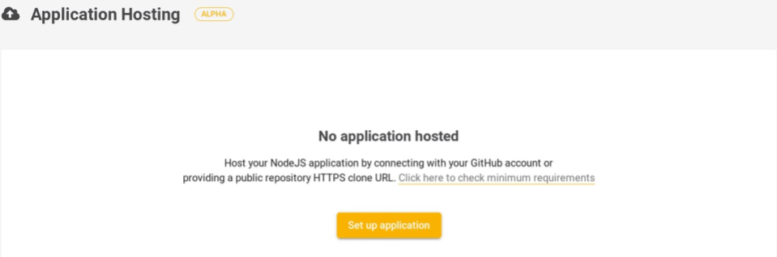
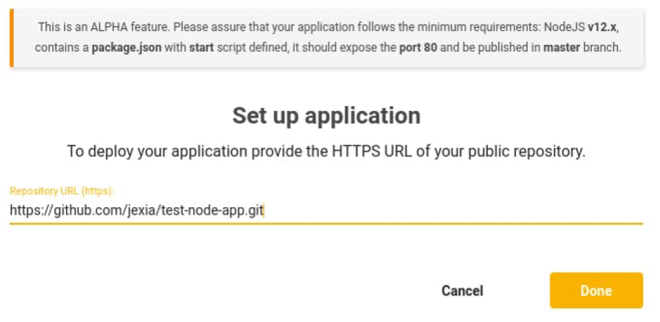
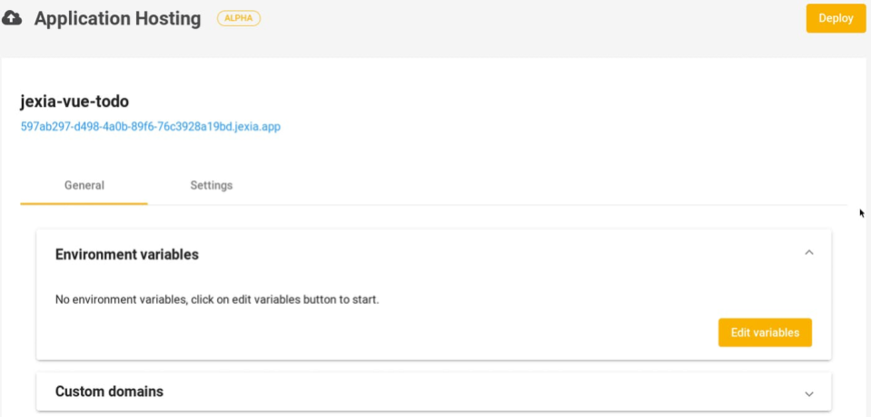
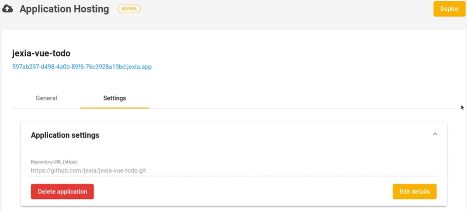
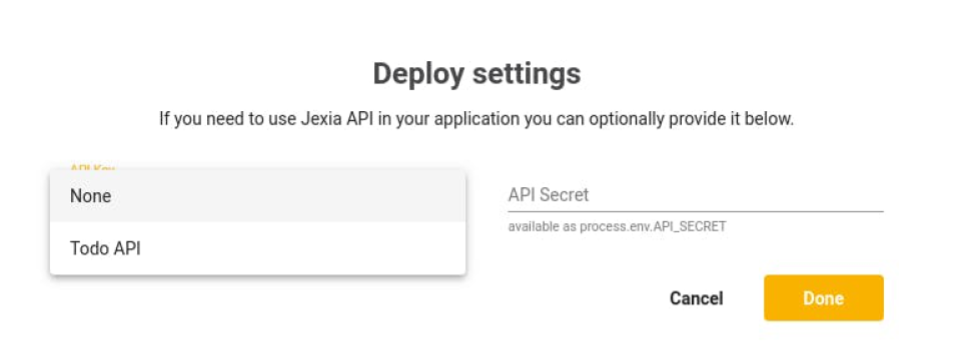
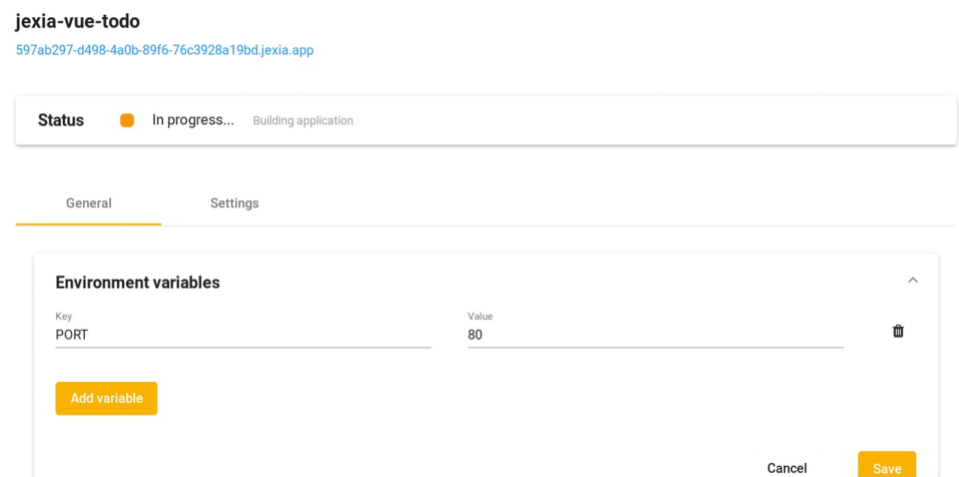
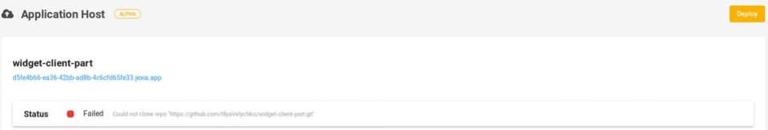
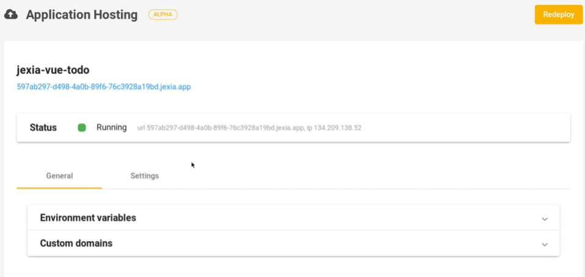

# Application Hosting

Jexia's Application Hosting can be used to organize your static files. Currently, you can host your Node JS application, your Docker images or simply static files. You can fetch an application directly from a git repository and deploy it on our cloud. Application Hosting can be used for example with React, VueJs, and Angular as frameworks. The only requirement is that the project listens on port `80`, please see the examples below.

## Common requirements: 

1. GitHub repo (open or private)
2. Project in Jexia
3. The application must use port `80`
4. The application must listen on `0.0.0.0`

## Build and run requirements:
### Dockerfile:
If there is a Dockerfile inside your repo it will be used for the building and deployment process.

### NodeJS
1. Your application must support NodeJS version 12 and the corresponding NPM version
2. Your application must contain a `package.json` file with the `build` and `start` scripts


## What do you get? 

1. Hosting for your React, VueJS, Angular, NodeJS, Python, Go, PHP and many more projects built in a variety of languages 
2. A subdomain provided by Jexia, such as `*.jexia.app`
3. THe possibility of adding your custom domain
4. SSL certificates for your subdomain
5. More free time to develop without spending time on issues regarding your deployment, setup, control and monitor processes

## How does it work? 

When you initiate your application via Jexia's Application Hosting, Jexia will clone your GitHub repo into a secure environment. In this environment Jexia will run `npm install` and `npm run build`. As soon as it is finished, the repo will be deployed into the cloud environment and a URL will be generated for your application. When the deployment has been completed, Jexia will run the `npm run start` command from your `package.json` file. As a last step, the cloned repo will be deleted from the secure environment.

## How to deploy?

### Step 1: Check if your GitHub repo has package.json file

First of all, you need to be sure that your repo contains a `package.json` file. Inside this file it must contain the `build` and `start` commands. See the example below:

```json
{
  "name" :  "My Jexia app",
  "version" :  "0.1.0",
  "scripts" : {
    "build" : "vue-cli-service build",
    "start" : "http-server ./dist -p 80"
  },
  "dependencies" : {
    "http-server" : "^0.11.1",
    "jexia-sdk-js" : "^4.1.0",
    "vue" : "^2.6.10"
  },
  "devDependencies" : {}
}
```
The `build` script should contain the command that builds your application ready for deployment. 

For example:

1. VueJS : `"build": "vue-cli-service build"`
2. React :  `"build": "cd packages/react-scripts && node bin/react-scripts.js build"`
3. Angular: `"build": "ng build *project* [options]"`
4. NodeJS : `"build": ""` -  can be an empty string. 

If you need to run some Pre- / Post-install scripts you need to combine these under the `build` script.

As you can see in our example, `"start": "HTTP-server ./dist -p 80"`, we use a HTTP server to organize and deploy static files. Here we listen on port `80` and use the `/dist` folder, which contains our ready-built project. More options can be found on the **HTTP server** package page. Feel free to implement any approach that suits you, but remember that port `80` needs to be used. 

::: tip
If you have a docker file present in your repo, we will use it to build & deploy the application. 
:::

### Step 2: Organize your projects at Jexia

*For Open Source GitHub projects.*

Go to the Application Hosting menu, then click on **Setup Application**.



The next page is related to the GitHub repo setup. You can get it by clicking the **Clone or Download** button on the GitHub webpage. It should look like: **https://github.com/jexia/test-node-app.git**



Jexia will check if it can read the repo and will show the repo name on the page. Under the name, you will see the generated URL for your application. You can use this after your project has been deployed.



Under the **General** tab, you can add environment variables. Inside your NodeJS application, those variables will be available via `process.env.<env name>`.

Under the **Settings** tab, you can adjust your GitHub repo.



As soon as the setup is done and you are ready to go - click the **Deploy** button. You will be transferred to a page where you can select your API Key and API Secret. That information will be transferred to your NodeJS application and will be accessible as:

* `process.env.API_KEY`
* `process.env.API_SECRET`
                                                                                                                                                                                        
It is not possible to use the `process.env.*` approach with Angular, VueJS and React applications. This is because your API Key and Secret will be available on the frontend. In this case, we recommend using a NodeJS backend, which will enable the ability for additional validation.    



After clicking **Done**, the deployment process will start. You will be able to see an indication to whether the deployment process has completed or not. Depending on the size of the repo, the deployment process can take around 3 to 7 minutes. 



There are two states for deployment: Done (green dot) or Fail (red dot). In the case of a red dot, confirm you can build your repo locally and check if you have a `package.json` with the `build` and `start` commands. If these are correct and present, try to re-deploy by clicking the **Deploy** button again. If you need further support, feel free to contact our support team.

::: tip
Failures can also be caused if you try to deploy a private repo on a free project plan. This will result in the error message: "Could not clone repo".
:::

If everything completes successfully, you will see a green dot:



As soon as the deployment is done your application will be accessible via a URL marked in blue on the screen.

## How to update the application once deployed?

There are two possibilities to make a re-deployment. Jexia is supports deployment without rebuilding code, this is useful when you need to update environment variables only. If you require a full re-build, the repo code will be downloaded from GitHub and the deploy process will begin again, with all previous environment variables.

To initiate a re-deployment, you need to click the **Redeploy** button (top right), which will appear as soon as the initial deployment has finished, instead of the **Deploy** button. 



After this, you will see a window with deployment options, this is where you can specify your **API_KEY** and **API_SECRET** as well as switch between building options. By default, we redeploy only environment variables, without pulling the repository from GitHub and rebuild the source code.

## For private GitHub projects.

The flow for private repos is almost the same. The only difference is that you need to allow Jexia to access your repo.


You will see another button that will allow you to authorize Jexia to clone your private repo. The rest of the process is the same as previously described. 

## Custom domain

There is a possibility to add your own domain to your application.

For this you need to have:
1. Successfully deployed application 
2. A domain with an `A` DNS record that points to your application's IP
3. Only one `A` record per domain should exist
4. After the domain has been added to your Jexia configuration, you would need to redeploy your application. You can re-deploy without the rebuild option (see above) 

It might take some time for your application to be be accessible via the new domain as your DNS needs to update its records.


## Delete application
To delete the application you can go to the **Settings** tab and then click the **Delete** button. You will need to enter the repo name to confirm the deleting operation. Please note, you are not able to delete the project until you have an application running. 

In our example, the repo name will be: `jexia-vue-todo`


## Examples
As for now, you can use these examples for deployment:
* VueJs TodoMVC: `https://github.com/jexia/jexia-vue-todo.git`
* NodeJS application: `https://github.com/jexia/test-node-app.git`

## Limitations
The current limitations are listed below:
* Your application can have no more than 265MB of RAM.
* We support NodeJS version 12.10
* We support NPM as the default package manager
* We use K8s for Application Hosting. Within this, there is no state management inside each 'pod', please ensure you use persistent storage for all data.
