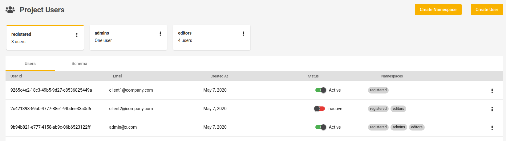

# Authentication 
Jexia provides two ways of authentication:
1. **API Key** - for a large amount of clients, unauthorized users and partners etc.
2. **Project User** - for specific users to have the ability to perform specific actions, such as updated or delete. 

By default, all data is inaccessible and you need to specify what resources can be accessed and by whom. Regardless of what option you choose for authentication, you will need to have a **policy** relating to either the API key or Users. 

<iframe width="700" height="394" src="https://www.youtube.com/embed/o2ZN3nvdhi8" frameborder="0" allow="accelerometer; autoplay; encrypted-media; gyroscope; picture-in-picture" allowfullscreen></iframe>

::: warning
Please keep in mind that the access token is valid for 2 hours. 
:::

## API Keys
An API key can be used to organize public access (for example your blog visitors). To create an API-Key you need to navigate to the **API keys** section and click **Create API Key** button.


When creating a new key, **Description** is a general-purpose field that should be used to describe the purpose of the new API key.
When you click on **Create API key**, the API key and API Secret will be generated. Please copy the API Secret to a safe location as you will not be able to access it again. We perform one-way encryption for the API secret. Therefore, the only way to get the secret again is to regenerate the API key. That is it, you are ready to create a **policy** for your new API key. 

For example, let's show how to provide **Read Only** access to our `orders` Dataset:


Using the automatically generated API, we can now interact with our data. 

<CodeSwitcher :languages="{js:'JavaScript',py:'Python',bash:'cURL'}">
<template v-slot:py>

``` py
from jexia_sdk.http import HTTPClient
JEXIA_PROJECT_ID = ''
JEXIA_API_KEY = ''
JEXIA_API_SECRET = ''
if __name__ == '__main__':
  client = HTTPClient()
  client.auth_consumption(
      project=JEXIA_PROJECT_ID,
      method='apk',
      key=JEXIA_API_KEY,
      secret=JEXIA_API_SECRET,
  )
  res = client.request(
          method='GET', 
          url='/ds/orders',
          cond='[{"field":"dislike"},"=",true]',
          outputs='["id","total","title"]'
        ) 
  print(res)
  
```

</template>
<template v-slot:js>

``` js
// Jexia client
import { jexiaClient, dataOperations } from "jexia-sdk-js/node";

const ds = dataOperations();

// You need to use your API Key / API Secret which is generated within your Jexia application. 
// Do not forget make a Policy for your API!
jexiaClient().init({
  projectID: "PROJECT_ID",
  key: "API_KEY",
  secret: "API_SECRET",
}, ds);

// Now you can run the read operation for your Datasets
const orders = ds.dataset("orders");
const selectQuery = orders
  .select()
  .where(field => field("dislike").isEqualTo(true));

selectQuery.subscribe(records => {
    // You will always get an array of created records, including their 
    // generated IDs (even when inserting a single record) 
  },
  error => {
    // If something goes wrong, the error information is accessible here 
});
```
</template>
<template v-slot:bash>

```bash
# Environment variables to be set
export PROJECT_ID=<project_id>
export API_KEY=<key_here>
export API_SECRET=<secret_here>

# save API key token to our environment in case we need to use it
export API_TOKEN=`curl -X POST -d '{
  "method":"apk",
  "key":"'"$API_KEY"'",
  "secret":"'"$API_SECRET"'"
}' "https://$PROJECT_ID.app.jexia.com/auth" | jq .access_token`

# Select all data with our API token
curl -H "Authorization: Bearer $API_TOKEN"
  -X GET "https://$PROJECT_ID.app.jexia.com/ds/orders" | jq .
```
</template>
</CodeSwitcher>

::: warning
Keep in mind at this point in time only the JS SDK automatically refreshes the access token. If you use the REST API or the Python SDK you need to handle this situation yourself. Each token lasts 2 hours. 
:::

## Project Users
Another way to authenticate within Jexia is to use **Project Users**. Usually, you need this when you want to provide more rights to specific users. Let's say **Update** and **Delete** actions for your blog can be done by owners only. Firstly, you need to create a user under the **Project Users** section.



After this, you need go to the **Policies** section and create a new policy, ensuring that **Subject** is selected for a specific **Namespace** or **User account** and the **Resource** is selected to the specific dataset, fileset or the 'AllUsers' option (for user table) if you want these users to be able to run the actions. Finally, select all **Actions** you wanted these users to perform.


This will allow any user from the namespace `registered` or the user with the email `admin@x.com` to have **Update & Delete** operations for all their records and the **Read** operation for all the records which have a schema field `confirmed` equal to `true`.

<CodeSwitcher :languages="{js:'JavaScript',py:'Python',bash:'cURL'}">
<template v-slot:py>

``` py
from jexia_sdk.http import HTTPClient

JEXIA_PROJECT_ID = 'project_id'
USER_EMAIL = 'admin@x.com'
USER_PASSWORD = 'secret-password'

if __name__ == '__main__':
  client = HTTPClient()
  client.auth_consumption(
      project=JEXIA_PROJECT_ID,
      method='ums',
      email=USER_EMAIL,
      password=USER_PASSWORD
  )
  # Make future requests with user access rights
  res = client.request(
          method='GET', 
          url='/ds/orders',
          cond='[{"field":"dislike"},"=",true]',
          outputs='["id","total","title"]'
        ) 
  print(res)
  
```

</template>
<template v-slot:js>

``` js
// Jexia client and Project Users module
import { jexiaClient, UMSModule} from "jexia-sdk-js/node"; 

const ums = new UMSModule(); 

jexiaClient().init({  
  projectID: "PROJECT_ID",  
}, ums); 

// Sign in with the user created in your Jexia project
ums.signIn({  
  email: 'admin@x.com',  
  password: 'secret-password'
}).subscribe(
  data=>{ ...do future selects... },
  error=>{... error handle...}
);  
```
</template>
<template v-slot:bash>

``` bash
# Environment variables to be set
export PROJECT_ID=<project_id>
export TEST_USER=admin@x.com
export TEST_USER_PSW=<password_here>

# save UMS token to our environment in case we need to access Project Users
export UMS_TOKEN=`curl -X POST -d '{
  "method":"ums",
  "email":"'"$TEST_USER"'",
  "password":"'"$TEST_USER_PSW"'"
}' "https://$PROJECT_ID.app.jexia.com/auth" | jq -r .access_token`

# Select all data with our ums token
curl -H "Authorization: Bearer $UMS_TOKEN"
  -X GET "https://$PROJECT_ID.app.jexia.com/ds/orders" | jq .
```

</template>
</CodeSwitcher>

::: warning
Keep in mind at this point in time only the JS SDK automatically refreshes the access token. If you use the REST API or the Python SDK you need to handle this situation yourself. Each token lasts 2 hours. 
:::

## Policies
As was mentioned above to authorize access to your data you need to have a **policy** created for your API keys and/or Project Users. 
Currently, you cannot manipulate a **policy** via the API. All admin actions are only available via Jexia's administration dashboard.

<iframe width="700" height="394" src="https://www.youtube.com/embed/i4dKznoXry0" frameborder="0" allow="accelerometer; autoplay; encrypted-media; gyroscope; picture-in-picture" allowfullscreen></iframe>

_* video shows previous version of policy screen_

There are four main areas within a **Policy**:
1. **Subject** (who has access) - can be an **API key**, **Namespace** (grouped users under the same name) or a **User account**.
2. **Resources** (access to what) - can be any dataset, fileset or channel. Selecting **All Users** means you allow  operations for all Project Users. 
3. **Actions** (what CRUD actions can be performed) - here you can specify which actions are allowed to be performed. These can be: Create, Read, Update and Delete. For Channels you have specific actions: Subscribe (read) and Publish (write). 
4. **Filters** - for actions you can use additional filtering options to specify access of current namespace, API or user. It is useful when you want to segrigate data access for different instances of your business, such as offices and e-shops etc.
We have a predefined filter - **Owner** which filters and shows only records where the user is an owner. It can be combined with additional filters to specify even more. All filters join with the **AND** logical operator. Changes for a policy are applied immediately.


If a namespace or particular user is part of multiple policies, access will be joined via the **OR** operator. 

For example:
1. User A -> Policy 1 -> Has CRUD for Orders dataset
1. User A -> Policy 2 -> Has R + filter (total>100) for Orders dataset

Result: User A will have full access to Orders dataset as Policy 2 is subset of Police 1


::: tip
You can create as many policies as you need. All of them will be evaluated during the request. Changes in a policy have an immediate effect. 
:::
