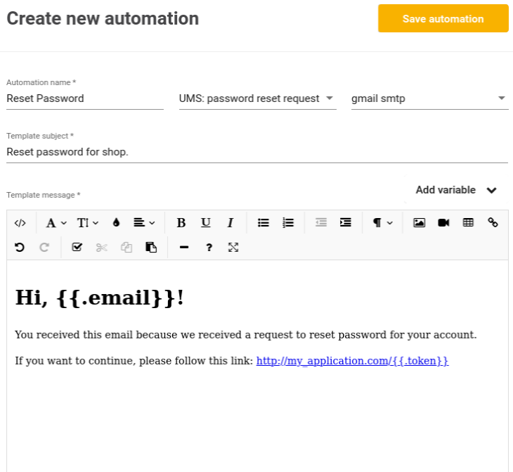

# Automation
Automation is a module which can be used to trigger a specific action when an event occurs. 
Below you can see an example for resetting a user's password:



1. **Automation name** - free form text to describe the action. This will be displayed on the list of automations. 
2. **Event**  - the event on which the action will be triggered. Currently, events are predefined by Jexia. If you would need any additional events, please let us know.
3. **Integration** - Select a an integration that you set up under the **Integration** section. Currently, we only have SMTP integrations. 
4. **Template subject** - this is the email subject which the user will see in his client. 
5. **Template body** - this is a message that the user will get in the email.
6. **Token** - an auto-generated token which you will need to change the password.
7. **Email** - the email will be taken from the **Project User** record. 

If you request a password change for an email which is not in the **Project User** list, you will get an error.  

## How does it work?
Let's say you setup integration and automation to catch the event `UMS: password reset request` for your project. When, your app requests a password reset for a user, the action will be triggered and an email will be sent to the user. The user's email will be taken from the **Project User** record. The email will have the template that you had created in the previous steps and the placeholders will be changed to their proper value. We currently have the following template values available: 
* `token` - The token needed to authorise the password reset.
* `email` - The user's email.

We expect your application will be managing endpoints to generate and accept a new password from the client as different applications have different requirements for password strengths as well as creating templates for the email. From your app page, you should send a request to Jexia with the token and the new password.

An example of this is below:

<CodeSwitcher :languages="{js:'JavaScript',py:'Python',bash:'cURL'}">
<template v-slot:py>

``` py
 # to request password reset
res = client.request(
      method='POST',
      data={"email": "user@email"},
      url='/ums/resetpassword/'
    )
# to apply changes
res = client.request(
      method='POST',
      data={"new_password": "jexia_super"},
      # token - user will get by email if you have Integration for SMTP
      url='ums/resetpassword/token'
    )
print(res)
  
```

</template>
<template v-slot:js>
 
```js
// To request email with new token: 
ums.requestResetPassword('Elon@tesla.com').subscribe(user => {}, error=>{}); ;

// To apply newPassword
// token - user will get by email if you have Integration for SMTP
ums.resetPassword(Token, newPassword).subscribe(user => {}, error=>{}); ;
```

</template>
<template v-slot:bash>

``` bash
# To request token for change password for specific email
curl 
-X POST -d '{
  "email":"user@email"
}' "https://$PROJECT_ID.app.jexia.com/ums/resetpassword/" | jq .


# To apply new password
# token - user will get by email if you have Integration for SMTP
curl 
-X POST -d '{
  "new_password": "jexia_super"
}' "https://$PROJECT_ID.app.jexia.com/ums/resetpassword/token" | jq .
```

</template>
</CodeSwitcher>
