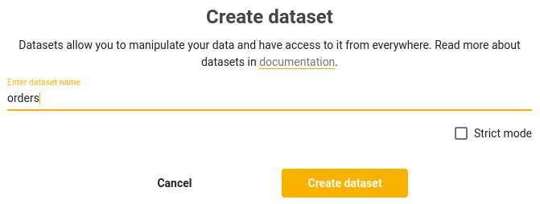
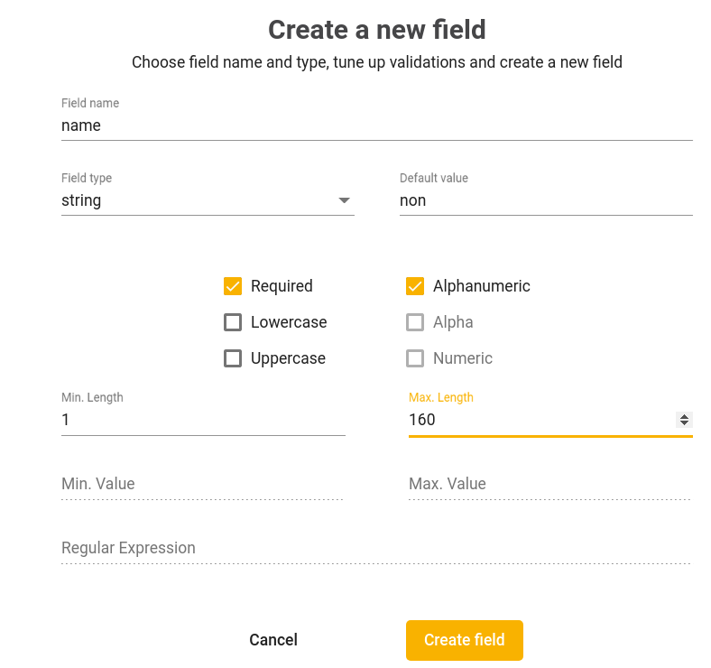
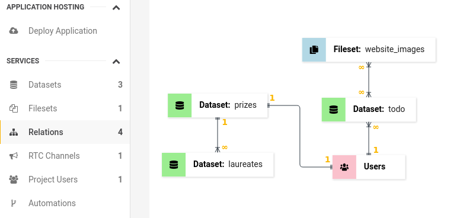

# Datasets
A Dataset is used to store your data in the cloud. You can interact with your data via a REST API and our SDKs. All data is protected with policy authorization. You can establish a relation between different datasets or other parts of the platform. You do not need to worry about database performance and security, such as: indexes, foreign keys, scaling, backups, SQL injections and other things related to database management, as we do all this for you to help speedup development. Each project has it's own instance of Dataset and other projects can't impact the stability and security of your project.

Datasets have built-in support for validation, schema & schemaless data and default values for fields. 

To create a dataset, click on the **Go to project** button and then on the next screen **Create dataset**:



The name of the dataset is used as an endpoint ( For example: `*.app.jexia.com/ds/dataset_name`) to allow you to communicate with the automatically generated REST API for your project. There are a few rules regarding dataset names, these are:
- The name of your dataset can contain only Latin characters and digits.
- The name of the dataset has to start with a character.

**Strict mode** - inform platform to apply strict rule about input data validation. If input object will have some fields which does not exist in  dataset schema insert / update operation will be rejected.   

## Configuration

## Schema

The next step is to add fields to your datasets. To create a field, click the **Add field** button. In the same window, you can input the different values for name, type, and validation of your field. You can also provide a default value for the field. Field name and validation parameters can be changed in the future via the edit field. However, the field type cannot be changed. If you want to change the type then you can only delete and create the field again. However, by deleting the field you will also lose the data stored in that field. With the Schema approach, you can set specific types for each field: String, Integer, Float, Date, DateTime, Boolean, JSON or UUID. Before a create or update action, the data will be validated against the validators.



::: tip
If you send a JSON object which has additional fields that are not set within the schema, those fields will be saved as schemaless fields. For those fields, validation rules and default values are not applicable.  
:::

## Schemaless
To apply the schemaless approach, just insert your JSON object into a dataset without creating any schema fields for the dataset. The data will be stored automatically with the type provided inside the JSON. Please, note that validations and default values do not apply to schemaless data. You can convert from Schemaless to Schema when the design for your project is stabilized. Jexia supports the following types: String, Integer, Float, Date, DateTime, Boolean, JSON and UUID as field types.

::: warning
Please, keep in mind when you convert the field from schemaless to schema, the data will not be migrated to the appropriate schema field. You need to do it on your own and control the quality of data being inputted. 

If you delete fields from a schema, the data related to that field will be deleted as well. It will not be converted back to schemaless.

When fetching data, if a field matches one on the dataset, the schema data will be returned. However, if a field does not match one on the dataset, it will be searched for via a schemaless method. The declared schema field takes priority over that of a schemaless field.

In case you have established relation between datasets, if a field matches one on parent dataset, the schema data will be returned, then the field will be search for in all child schemes. If a field does not match one on any of the related datasets, it will be searched for via a schemaless method. The declared schema field within the parent takes priority over that of both a child schema and schemaless field. However, the declared child schema field takes priority over that of any schemaless field.
:::

## Validation

This depends on the field type. The most validators are available for a string type. Such as: Required, UpperCase, LowerCase, Alphanumeric, Numeric, Alpha, Min/ Max length and RegEx pattern matching.

For Float and Integer, there are only: Required and Min/ Max value validators.

In the future, we plan to add Date range and other validators.

You might see that when you select some validators, others may become unavailable. This is due to logical exclusion. For example, it is not logical to have Upper and Lower case validators at the same time. To reduce the possibility of human mistakes we decided to disable selection for some combinations.

::: tip
Please keep in mind that validation is applicable for schema fields only. Jexia applies the same validation rules for every Create and Update action.
:::

## Default values
You can set up default values for each field. This value will be validated against type and validation constraints.

::: warning
Please keep in mind that for a string type it is not possible to set a default value as an empty string `''`, you can get either set a value or input `null` which will be passed as a `null` type.
:::

## Insert a record
To create a record in Jexia's dataset you need to create an action within either a policy for a User or API key. Below you can see the User approach as it has a wider use case for record creation.

::: tip
Please keep in mind that the API always returns an array of records, even if you only insert one record. Because of this, you can apply the same approach for data manipulation. 
:::

<CodeSwitcher :languages="{js:'JavaScript',py:'Python',bash:'cURL'}">
<template v-slot:py>

``` py
from jexia_sdk.http import HTTPClient

JEXIA_PROJECT_ID = 'project_id'
USER_EMAIL = 'user@jexia.com'
USER_PASSWORD = 'secret-password'

if __name__ == '__main__':
  client = HTTPClient()
  client.auth_consumption(
      project=JEXIA_PROJECT_ID,
      method='ums',
      email=USER_EMAIL,
      password=USER_PASSWORD
  )
  to_save = {
    'title':"Order1",
    'total':10,
    'verified':false
  }
  res = client.request(
          method='POST',
          data=to_save,
          url='/ds/orders',
          outputs='["id"]'
        ) 
  print(res)
  
```

</template>
<template v-slot:js>

``` js
import { jexiaClient, dataOperations,UMSModule } from "jexia-sdk-js/node"; 
const ds = dataOperations();
const ums = new UMSModule(); 

jexiaClient().init({
  projectID: "PROJECT_ID",
}, ds, ums);

  ums.signIn({    
    email: 'Elon@tesla.com',    
    password: 'secret-password'
  }).subscribe(
    data=>{
      let orders_data = [{
            "title":"Order1",
            "total":10,
            "verified":false
        }, {
            "title":"Order2",
            "total":100,
            "verified":false
        }]
        const orders = ds.dataset("orders");
        const insertQuery = orders.insert(orders_data);  
        insertQuery.subscribe(records => { 
            // You will always get an array of created records, including their 
            // generated IDs (even when inserting a single record) 
          }, 
          error => { 
            // If something goes wrong, the error information is accessible here 
        });
    },
    error=>{
      console.log(error)
    }
  );  

  
}

```
</template>
<template v-slot:bash>

``` bash
# Environment variables to be set
export PROJECT_ID=<project_id>
export TEST_USER=<user_here>
export TEST_USER_PSW=<password_here>

# save UMS token to our environment as we need to access Project Users
export UMS_TOKEN=`curl -X POST -d '{
  "method":"ums",
  "email":"'"$TEST_USER"'",
  "password":"'"$TEST_USER_PSW"'"
}' "https://$PROJECT_ID.app.jexia.com/auth" | jq -r .access_token`

#Insert record
curl -H "Authorization: Bearer $UMS_TOKEN" -X POST -d '[{
  "title":"Order1",
  "total":10,
  "verified":false
},
{
  "title":"Order2",
  "total":100,
  "verified":false
}]' "https://$PROJECT_ID.app.jexia.com/ds/orders" | jq .
```

</template>
</CodeSwitcher>

After execution, you will receive an array similar to the following array of objects:
```JSON
[{
    "id": "e0e17683-f494-4f33-8343-ffed792b324e",
    "created_at": "2020-02-15T19:43:39.784342Z",
    "updated_at": "2020-02-15T19:43:39.784342Z",
    "title":"Order1",
    "total":10,
    "verified":false
}, {
    "id": "e0e17683-f494-4f33-9563-dded795e3121",
    "created_at": "2020-02-15T19:43:39.784342Z",
    "updated_at": "2020-02-15T19:43:39.784342Z",
    "title":"Order2",
    "total":100,
    "verified":false
}]
```

## Read a record
To fetch your data you need to have the **Read** action selected on a policy which also contains the particular resource you are trying to access. You can apply different filters to get specific data. In the following example you can see an API key usage as the most common approach.

<CodeSwitcher :languages="{js:'JavaScript',py:'Python',bash:'cURL'}">
<template v-slot:py>

``` py
from jexia_sdk.http import HTTPClient
JEXIA_PROJECT_ID = ''
JEXIA_API_KEY = ''
JEXIA_API_SECRET = ''
if __name__ == '__main__':
  client = HTTPClient()
  client.auth_consumption(
      project=JEXIA_PROJECT_ID,
      method='apk',
      key=JEXIA_API_KEY,
      secret=JEXIA_API_SECRET,
  )
  res = client.request(
          method='GET', 
          url='/ds/orders',
          cond='[{"field":"dislike"},"=",true]',
          #cond=[{"field":"total"},"null",true, "or", {"field":"total"},"in",["1","2"]]
          #cond=[[{"field":"title"},"null",false, "or", {"field":"total"},"in",["1","2"]], "and", {"field":"created_at"}, ">", "24h"]
          #cond=[{"field":"title"},"regexp","^A", "and", {"field":"total"},">",21]
          #cond=[{"field":"some.field"},"null", false]
          outputs='["id","total","title"]',
          range='{"limit": 10}'
        ) 
  print(res)
```

</template>
<template v-slot:js>

Due to the JS SDK being built on top of RxJS. Once installed, you can use the power of the RxJS library and use all available methods provided by this library.  

``` js
// Jexia client
import { jexiaClient, dataOperations, field } from "jexia-sdk-js/node"; 

const ds = dataOperations();

jexiaClient().init({
  projectID: "PROJECT_ID",
  key: "API_KEY",
  secret: "API_SECRET",
}, ds);

const orders = ds.dataset("orders");
const selectQuery = orders
  .select()
  .where(field => field("verified").isEqualTo(true))
  // .where(field("title").isDifferentFrom("test")) 
  // .where(field("total").isBetween(1,30))
  // .where(field("total").isEqualOrGreaterThan(15))
  // .where(field("total").isEqualOrLessThan(7))
  // .where(field("total").isEqualTo(100))
  // .where(field("total").isGreaterThan(57))
  // .where(field("total").isLessThan(100))
  // .where(field("id").isInArray(my_val))   // my_val=[uuid1,uuid2];
  // .where(field("id").isNotInArray(my_val)) // my_val=[uuid1,uuid1];
  // .where(field("title").isLike("Charlotte's Web"))
  // .where(field("title").isNotNull())
  // .where(field("title").isNull())
  // .where(field("title").satisfiesRegexp('a-z0-9'))   
selectQuery.subscribe(records => { 
    // You will always get an array of created records, including their 
    // generated IDs (even when inserting a single record) 
  }, 
  error => { 
    // If something goes wrong, the error information is accessible here 
});
```

</template>
<template v-slot:bash>

``` bash
# Select all data
curl -H "Authorization: Bearer $UMS_TOKEN" 
  -X GET "https://$PROJECT_ID.app.jexia.com/ds/orders" | jq .

# Select by id
curl -H "Authorization: Bearer $UMS_TOKEN" 
  -X GET "https://$PROJECT_ID.app.jexia.com/ds/orders?
  cond=\[\{\"field\":\"id\"\},\"=\",\"2a51593d-e99f-4025-b20b-159e226fc47d\"\]" | jq .

# Select special fields
curl -H "Authorization: Bearer $UMS_TOKEN" 
  -X GET "https://$PROJECT_ID.app.jexia.com/ds/orders?
  outputs=\[\"title\",\"verified\"\]" | jq .

# Select special fields + where
curl -H "Authorization: Bearer $UMS_TOKEN" 
  -X GET "https://$PROJECT_ID.app.jexia.com/ds/orders?
  outputs=\[\"title\",\"verified\"\]&cond=\[\{\"field\":\"total\"\},\">\",10\]" | jq .

# Select special fields + where
# Find any record that does not have total or total equals 1 or 2:
# [GET] /ds/orders?cond=[{"field":"total"},"null",true, "or", {"field":"total"},"in",["1","2"]]

# Find any record that has title or its total equals 1 or 2, but the results must be older than one day:
# [GET] /ds/orders?cond=[[{"field":"title"},"null",false, "or", {"field":"total"},"in",["1","2"]], "and", {"field":"created_at"}, ">", "24h"]

# Get any orders where title starts with the letter "A" and total > 21:
# [GET] /ds/orders?cond=[{"field":"title"},"regexp","^A", "and", {"field":"total"},">",21]

# Find a record by nested field where field some.field exists (is not null):
# [GET] /ds/orders?cond=[{"field":"some.field"},"null", false]
 
```

You can have any of the following comparators in a request containing `?cond`:

Comparator group|**comparator**|**value**|Applicable field types
----------------|------------|-------|----------------------
Equality comparators|“>”, “<”, “=”, “!=”, “>=”, “<=”|single value matching field type|all fields
Emptiness comparators|“null”|true or false|all fields
Range comparator|“between”|[start, end]|textual, numbers, date/times
Array comparators|“in”, “not in”|Array of allowed values (matching field type)|all fields
Pattern comparator|“like”|string value|textual
Regex comparator|“regexp”|string value|textual

You can use the following operators to make advanced requests: `and`, `&&`, `or` and `||`.

</template>
</CodeSwitcher>

After execution, you will receive an array similar to the following array of objects:


```JSON
[{
    "id": "e0e17683-f494-4f33-9563-dded795e3121",
    "created_at": "2020-02-15T19:43:39.784342Z",
    "updated_at": "2020-02-15T19:43:39.784342Z",
    "title":"Order2",
    "total":100,
    "verified":true
}]
```

## Delete a record
To delete a record you need to have selected the Delete action in the policy for the resource you intend to edit. 
Some examples can be seen below using the Project User method. 

When you perform a Delete action, you will get back an array of affected records so you can sync changes with your front-end application.  

<CodeSwitcher :languages="{js:'JavaScript',py:'Python',bash:'cURL'}">
<template v-slot:py>

``` py
from jexia_sdk.http import HTTPClient
JEXIA_PROJECT_ID = ''
USER_EMAIL = ''
USER_PASSWORD = ''
if __name__ == '__main__':
  client = HTTPClient()
  client.auth_consumption(
      project=JEXIA_PROJECT_ID,
      method='ums',
      key=USER_EMAIL,
      secret=USER_PASSWORD
  )
  res = client.request(
          method='DELETE', 
          url='/ds/orders',
          cond='[{"field":"id"},"=","2a51593d-e99f-4025-b20b-159e226fc47d"]'
        ) 
  print(res)
```

</template>
<template v-slot:js>

``` js
import { jexiaClient, UMSModule, dataOperations } from "jexia-sdk-js/node"; 
// to use .where and .outputs
import { field } from "jexia-sdk-js/node"; 

const ds = dataOperations();
const ums = new UMSModule(); 

jexiaClient().init({
  projectID: "project_id",
}, ds, ums);

ums.signIn({    
    email: 'Elon@tesla.com',    
    password: 'secret-password'
}).subscribe(
  good=>{
    const orders = ds.dataset("orders");
    const deleteQuery = orders
    .delete()
    .where(field => field("id").isEqualTo("2a51593d-e99f-4025-b20b-159e226fc47d"));  

    deleteQuery.subscribe(
      records => { 
        // You will always get an array of created records, including their 
        // generated IDs (even when inserting a single record) 
      }, 
      error => { 
        // If something goes wrong, the error information is accessible here 
    });
  },
  error=>{
    console.log(error)
  }
);

```
</template>
<template v-slot:bash>

``` bash
# Select by id
curl -H "Authorization: Bearer $UMS_TOKEN" 
  -X DELETE "https://$PROJECT_ID.app.jexia.com/ds/orders?
  cond=\[\{\"field\":\"id\"\},\"=\",\"2a51593d-e99f-4025-b20b-159e226fc47d\"\]" | jq .
```

</template>
</CodeSwitcher>

After execution, you will receive an array similar to the following array of objects:


```JSON
[{
    "id": "e0e17683-f494-4f33-9563-dded795e3121",
    "created_at": "2020-02-15T19:43:39.784342Z",
    "updated_at": "2020-02-15T19:43:39.784342Z",
    "title":"Order2",
    "total":100,
    "verified":true
}]
```
## Update a Record

To update a record you need to have selected the Update action in the policy for the resource you intend to edit.
Some examples can be seen below using the Project User method.

When you perform an Update action, you will get back an array of affected records so you can sync changes with your front-end application.  

::: tip
You can add an `id` field into the update object, Jexia will find and update it automatically.
:::

<CodeSwitcher :languages="{js:'JavaScript',py:'Python',bash:'cURL'}">
<template v-slot:py>

``` py
from jexia_sdk.http import HTTPClient
JEXIA_PROJECT_ID = ''
USER_EMAIL = ''
USER_PASSWORD = ''
if __name__ == '__main__':
  client = HTTPClient()
  client.auth_consumption(
      project=JEXIA_PROJECT_ID,
      method='ums',
      key=USER_EMAIL,
      secret=USER_PASSWORD
  )
  #if you will have ID in objects you do not need cond='....'
  to_save={
              'id':'recID',
              'verified':true
          }
  res = client.request(
          method='PUT', #PATCH - partial update for record
          data=to_save, 
          url='/ds/orders'
        ) 
  print(res)
```

</template>
<template v-slot:js>

``` js
import { jexiaClient, UMSModule, dataOperations } from "jexia-sdk-js/node"; 
// to use .where(field("total").isBetween(0,50)) and .outputs
import { field } from "jexia-sdk-js/node"; 

const ds = dataOperations();                      
const ums = new UMSModule(); 

jexiaClient().init({
  projectID: "project_id",
}, ds, ums);

ums.signIn({    
    email: 'Elon@tesla.com',    
    password: 'secret-password'
}).subscribe(
  user=>{
    const orders = ds.dataset("orders");
    const updateQuery = orders
      .update([{id:"3005a8f8-b849-4525-b535-a0c765e1ef8e", verified: true }]) // To update 1 record with specific ID
      //.where(field => field("total").isBetween(0,50).and(field("name").isLike('%avg'))); // To update update batch of records 

    updateQuery.subscribe(records => { 
        // You will always get an array of created records, including their 
        // generated IDs (even when inserting a single record) 
      }, 
      error => { 
        // If something goes wrong, the error information is accessible here 
    });
  },
  error=>{
    console.log(error)
  }
)

  

```
</template>
<template v-slot:bash>

``` bash
# Update by id
curl -H "Authorization: Bearer $UMS_TOKEN" -d '{
  "id":"3005a8f8-b849-4525-b535-a0c765e1ef8e",
  "text":"New post",
  "author":"Roy Ban",
  "views":2
}' -X PUT "https://$PROJECT_ID.app.jexia.com/ds/orders" | jq .
```

</template>
</CodeSwitcher>

After execution, you will receive an array similar to the following array of objects:


```JSON
[{
    "id": "3005a8f8-b849-4525-b535-a0c765e1ef8e",
    "created_at": "2020-02-15T19:43:39.784342Z",
    "updated_at": "2020-02-16T13:15:00.784342Z",
    "title":"Order1",
    "total":10,
    "verified":true
}]
```

## Related Data
If you created multiple datasets you can establish relations between them. You can do it under the **Relations** section. Currently, Jexia supports relation types of:
- One to One
- One to Many
- Many to One
- Many to Many


<iframe width="700" height="394" src="https://www.youtube.com/embed/E_wxTnQ3clQ" frameborder="0" allow="accelerometer; autoplay; encrypted-media; gyroscope; picture-in-picture" allowfullscreen></iframe>



When do you need this? For example, you can keep users and their TODOs in separate datasets. With Jexia you do not need to worry about external keys and index optimizations to organize all of this, it will be automatically managed by Jexia.

Another cool thing, as soon as you set up a relation, you can insert an object which has a _parent / child_ relation inside and Jexia will automatically put data in the proper places. For example, I have dataset: `orders` and dataset: `items` with a one to many relation. So I can insert the following object into `orders` and the data will automatically be organized in its proper place:

```json
{
    "title":"Order1",
    "total":10,
    "verified":false,
    "items": [
        {
            "name":"Item 1",
            "qty":2
        },
        {
            "name":"Item 3",
            "qty":20
        }
    ]
}
```
During fetching data you can specify if you want to get only the parent or parent and child data.

<CodeSwitcher :languages="{js:'JavaScript',py:'Python',bash:'cURL'}">
<template v-slot:py>

``` py
...

  res = client.request(
          method='GET', 
          url='/ds/orders',
          outputs=["items.qty"],
          range='{"limit": 10}'
        ) 
  print(res)
```

</template>
<template v-slot:js>

``` js
sdk.dataset("orders")
  .select()
  .related("items", items => items.fields("qty"))
  .subscribe(
    res => {
      console.log(res);
    },
    error=>{
      console.log(error)
    });
```
</template>
<template v-slot:bash>

``` bash
#GET https://<your-app-id>.app.jexia.com/ds/<your-dataset>?outputs=["<related_dataset>"]
#Next request will return only Qty field from related items dataset
https://{{projectID}}.app.jexia.com/ds/orders?outputs=["items.qty"] 
```

</template>
</CodeSwitcher>

After execution, you will receive an array similar to the following array of objects:


```json
[{
  "id": "...",
  "created_at": "...",
  "updated_at": "...",
  "title":"Order1",
  "total":10,
  "verified":false,
  "items": [
    {
      "id": "...",
      "qty": 2
    },
    {
      "id": "...",
      "qty":20
    }
  ]
}]
```

If you want to get other related data, you just need to add them to request, Jexia will do matching automatically and send it back in result JSON. Easier than GaphQL, yeh? :D

::: tip
Please keep in mind that currently it is not possible to make a relation with a dataset itself (for example for multi-level menu). It is still possible to create a child and have a **one to many** relation between them and the dataset however.
:::


## Multi-level Relations
You can have multiple levels of relation. For example: _Article / Comments / Author / Salary_. With Jexia you can build such a case and you will be able to fetch all data in one response.  

<CodeSwitcher :languages="{js:'JavaScript',py:'Python',bash:'cURL'}">
<template v-slot:py>

``` py
...
  res = client.request(
          method='GET', 
          url='/ds/orders',
          outputs=["article.comments.author.name", "article.comments.author.employee.salary"],
          range='{"limit": 10}'
        ) 
  print(res)
```

</template>
<template v-slot:js>

``` js
dom.dataset("article")
  .select()
  .related("comments", comments => comments
    .fields("name", "likes")
    .related("authors"), author => author
      .fields("name", "id")
      .related("employee"), data => data
          .fields("salary", "id")
      )
    )
  )
  .subscribe(...)
```
</template>
<template v-slot:bash>

``` bash
# Next call will return all parent and chiled records and fields 
GET /ds/article/comments/authors/employee
# To get some specific fields:
GET /ds/article?outputs=["article.comments.author.name", "article.comments.author.employee.salary"]
```

</template>
</CodeSwitcher>

## Attach and Detach records
If you need create a relation between already existing data, you can use the `.attach()` and `.detach()` methods.
For this you need to specify which parent for which you want to attach the child record. In the example that follows, it is creating a relation between order (with id = my_uuid ) and two `items` objects with the IDs `b4961b6a-85a2-4ee8-b946-9001c978c801` and `e199d460-c88f-4ab9-8373-1d6ad0bd0acb`. 

<CodeSwitcher :languages="{js:'JavaScript',py:'Python',bash:'cURL'}">
<template v-slot:py>

``` py
    ....
    res = client.request(
          method='PUT', 
          url='/ds/orders',
          cond='[{"field":"id"},"=","b4961b6a-85a2-4ee8-b946-9001c978c801"]',
          action='attach',
          action_resource='items',
          action_cond='[{"field":"id"},"in",["b4961b6a-85a2-4ee8-b946-9001c978c801","e199d460-c88f-4ab9-8373-1d6ad0bd0acb"]]'
        ) 
    print(res)
```

</template>
<template v-slot:js>

```js
dom.dataset("order")
    .where(field("id").isEqualTo('my_uuid'));
    .attach("items", [
      "b4961b6a-85a2-4ee8-b946-9001c978c801",
      "e199d460-c88f-4ab9-8373-1d6ad0bd0acb",
    ])
    .subscribe();
```
</template>
<template v-slot:bash>

```bash
PUT https://<your-app-id>.app.jexia.com/ds/<your-dataset>?action=attach&cond=...&action_cond=...&action_resource=...&action_etc=...
```
Parameter|Type/Value|Description
---------|----------|-----------
action|"attach"/"detach"|Select the action to perform
action_cond|JSON array|Condition for the action (to select the child records) same as Filter parameter filtering
action_resource|string|Name of the child resource must be accessible via relation from parent
action_order|JSON object|same as Filter parameter order
action_range|JSON object|same as Filter parameter range

</template>
</CodeSwitcher>

## <pro/> Real-Time Notifications


If you want to have real-time updates regarding changes on datasets, you can use a real-time notification which is built into the dataset, fileset and project user modules.

<iframe width="700" height="394" src="https://www.youtube.com/embed/TR9fcT8gXtM" frameborder="0" allow="accelerometer; autoplay; encrypted-media; gyroscope; picture-in-picture" allowfullscreen></iframe>

After an action has taken place, you will get a notification containing the record ID which was modified. You can then re-fetch this data from Jexia. We only send the ID for security reasons, as there might be a situation where many users will be subscribed to notifications but they should not have access to data itself. With the current approach, you can decide whom to show the data.

You can use the `.watch()` method to subscribe to the notifications. Allowed actions can be provided either as arguments or as an array:
1. created
2. updated
3. deleted
4. all (used by default)

You can unsubscribe from notifications any time by calling the `.unsubscribe()` method.
Keep in mind that you would need to import the `realTime` module from our SDKs.

``` js
import { jexiaClient, dataOperations, realTime } from "jexia-sdk-js/node";
const ds = dataOperations();
const rtc = realTime();

// Initialize Jexia client
jexiaClient().init(credentials, ds, rtc);

const subscription = ds.dataset("orders")
  .watch("created", "deleted")
  .subscribe(messageObject => {
    console.log("Realtime message received:", messageObject.data);
  }, error => {
    console.log(error);
  });

// here put Insert or Delete operations

subscription.unsubscribe();
```


## Filtering
You can use filtering to specify which data to return. You will always receive an array of objects, independent on the number of objects. There are different approaches applied to different languages. Please check your preferable method.

<CodeSwitcher :languages="{js:'JavaScript',py:'Python',bash:'cURL'}">
<template v-slot:py>

``` py
    ....
    #cond='[{"field":"total"},">",0]' // “<”, “=”, “!=”, “>=”, “<=”
    #cond='[{"field":"total"},"=",null]'
    #cond='[{"field":"total"},"between",[0,8]]'
    #cond='[{"field":"total"},"in",[0,5,15]]'  // "not in"
    #cond='[{"field":"title"},"like","as"]'
    #cond='[{"field":"title"},"regex","^[a-z]+$"]'
    #cond='[{"field":"total"},">",100,"and",{"field":"title"},"like","as"]'
    res = client.request(
          method='GET', 
          url='/ds/orders',
          cond='[{"field":"id"},"=","b4961b6a-85a2-4ee8-b946-9001c978c801"]'
        ) 
    print(res)
```

</template>
<template v-slot:js>

``` js
import { field } from "jexia-sdk-js/node"; 
...

// Below are some examples using filters:
.where(field("title").isDifferentFrom("test")) 
.where(field("total").isBetween(1,30))
.where(field("total").isEqualOrGreaterThan(15))
.where(field("total").isEqualOrLessThan(7))
.where(field("total").isEqualTo(100))
.where(field("total").isGreaterThan(57))
.where(field("total").isLessThan(100))
.where(field("id").isInArray(["uuid1","uuid2"]))
.where(field("id").isNotInArray(["uuid1","uuid2"]))
.where(field("title").isLike("%oby"))
.where(field("title").isNotNull())
.where(field("title").isNull())
.where(field("title").satisfiesRegexp('[A-Z][0-9]*')) 

const isAuthorTom = field("user_name").isEqualTo("Tom");  
const isAuthorDick = field("user_name").isEqualTo("Dick");  

// Example for applying AND / OR grouping.
const isAuthorTomOrDick = isAuthorTom.or(isAuthorDick);  
const isAuthorTomOrDick = isAuthorTom.and(isAuthorDick);  

// In order to use these conditions,
// they need to be added to a query through the `.where` method.
ds.dataset("posts")  
 .select()
 .where(isAuthorTomOrDick)
 .subscribe(records => {}, error=>{}) // posts of Tom and Dick); 
```
</template>
<template v-slot:bash>

There are also some optional filtering parameters which allow you to specify which records to select. If they are not provided, the request is applied on all records. Each filter needs these three variables: `field`, `comparator` and `value`.
Multiple queries within a (nested) condition are combined using an `operator`.

``` bash
#cond=[<expression>, <comparator>, <expression>|<nested cond>, [<operator>, <expression>, <comparator>, <expression>|<nested cond>, [...]]]

$ curl -s 
-H "Authorization: Bearer $JEXIA_TOKEN" 
-X GET "https://$PROJECT_ID/ds/orders?cond=\[\{\"field\":\"total\"\},\">\",\"0\"\]" | jq .

#?cond=[{"field":"total"},">",0] // “<”, “=”, “!=”, “>=”, “<=”
#?cond=[{"field":"total"},"=",null]
#?cond=[{"field":"total"},"between",[0,8]]
#?cond=[{"field":"total"},"in",[0,5,15]]  // "not in"
#?cond=[{"field":"title"},"like","as"]
#?cond=[{"field":"title"},"regex","^[a-z]+$"]
#?cond=[{"field":"total"},">",100,"and",{"field":"title"},"like","as"]
```

Below you can find examples for available comparators:

Comparator group | comparator| value | Applicable field types
-----------------|-----------|-------|-----------------------
Equality comparators|“>”, “<”, “=”, “!=”, “>=”, “<=”|single value matching field type|all fields   
Emptiness comparators|“null”|true or false|all fields
Range comparator|“between”|[start, end]|textual, numbers, date/times
Array comparators|“in”, “not in”|Array of allowed values (matching field type)|all fields
Pattern comparator|“like”|string value|textual
Regex comparator|“regex”|string value|textual

There following operators are available to combine filters: `and`, `&&`, `or` and `||`

</template>
</CodeSwitcher>


## Response Fields
Sometimes you will want to show specific fields from record instead of the whole record. Jexia enables you to do this by allowing you to specifying what fields you want have returned. This is applicable to related data.

<CodeSwitcher :languages="{js:'JavaScript',py:'Python',bash:'cURL'}">
<template v-slot:py>

``` py
    ....
    res = client.request(
          method='GET', 
          url='/ds/orders',
          outputs='["titels","items.qty"]'
        ) 
    print(res)
```

</template>
<template v-slot:js>

``` js
const orders = ds.dataset("orders");

orders.select()
  .fields("title", "items.qty") // You can also pass an array of field names 
  .subscribe(records => {}, err=>{}); // You will get array of {id, title, author} please keep in mind "id" is always returned
```
</template>
<template v-slot:bash>

``` bash
$ curl -s -H "Authorization: Bearer $UMS_TOKEN" 
-X GET "https://$PROJECT_ID.app.jexia.com/ds/orders?&outputs=\[\"titels\",\"items.qty\"\]" | jq .
```

</template>
</CodeSwitcher>

```json
[
  {
    "title": "Order1",
    "id": "bc3f13fd-5e0c-4319-98d4-f4373222488f",
    "items":[
      {
        "id":"...",
        "qty":2
      }
    ]
  }
]
```


## Limits & Offsets
You can use `limit` and `offset` on a query to paginate your records. They can be used separately or together. Only setting the limit (to a value of `X`) will make the query operate on the first `X` records. Only setting the offset (to a value of `Y`) will make the query operate on the following `Y` records, starting from the offset value.

<CodeSwitcher :languages="{js:'JavaScript',py:'Python',bash:'cURL'}">
<template v-slot:py>

``` py
    ....
    res = client.request(
          method='GET', 
          url='/ds/orders',
          range='{"limit": 5, "offset": 3}'
        ) 
    print(res)
```

</template>
<template v-slot:js>

``` js
const orders = ds.dataset("orders");

orders.select()
  .limit(2)
  .offset(5)
  .subscribe(records =>{}, err=>{}) // Will return an array of 2 records, starting from position 5
```
</template>
<template v-slot:bash>

``` bash
# Will return an array of 5 records, starting from position 3
$ curl -s -H "Authorization: Bearer $UMS_TOKEN" 
-X GET "https://$PROJECT_ID.app.jexia.com/ds/orders?range={\"limit\": 5, \"offset\": 3}" | jq .

```

</template>
</CodeSwitcher>

## Sorting
To sort the data before it is returned, you can apply sort methods. These can be `Asc` and `Desc` directions. 

<CodeSwitcher :languages="{js:'JavaScript',py:'Python',bash:'cURL'}">
<template v-slot:py>

``` py
    ....
    res = client.request(
          method='GET', 
          url='/ds/orders',
          order='{"direction":"desc","fields":["total","created_at"]}'
        ) 
    print(res)
```

</template>
<template v-slot:js>

``` js
const orders = ds.dataset("orders");

posts
  .select()
  .sortAsc("total")
//.sortDesc("total")
  .subscribe(records => { 
    // You've got sorted records here 
  }, err=>{});
```
</template>
<template v-slot:bash>

``` bash
# order={"direction":"asc|desc","fields":["field_one","field_two","field_N"]}
$ curl -s -H "Authorization: Bearer $UMS_TOKEN" 
-X GET "https://$PROJECT_ID.app.jexia.com/ds/orders?order={\"direction\":\"desc\",\"fields\":[\"total\",\"created_at\"]}" | jq .
```

</template>
</CodeSwitcher>


## Aggregation Functions
There are a few aggregation functions you can use in order to complete calculations before obtaining data:
1. max
2. min
3. sum
4. avg
5. count

::: warning
Please keep in mind that you can aggregate fields only from schema. We do not support aggregation for fields from schemaless. 
:::

You can combine output with other fields. 


<CodeSwitcher :languages="{js:'JavaScript',py:'Python',bash:'cURL'}">
<template v-slot:py>

``` py
    ....
    res = client.request(
          method='GET', 
          url='/ds/orders',
          outputs='[{"sum_total": "sum(total)"}]'
        ) 
    print(res)
```

</template>
<template v-slot:js>

``` js
const posts = ds.dataset("orders");

posts.select()
  .fields({ fn: "sum", field: "total", alias: "sum_total"})
  .subscribe(result => {
  }, err=>{});
```
</template>
<template v-slot:bash>

``` bash
$ curl -s -H "Authorization: Bearer $UMS_TOKEN" 
-X GET "https://$PROJECT_ID.app.jexia.com/ds/orders?outputs=\[{\"sum_total\": \"sum(total)\"}\]" | jq .
```

</template>
</CodeSwitcher>

After execution, you will receive an array similar to the following array of objects:
```json
[
  {
    "sum_total": 202
  }
]
```

## REST API Errors
During REST API request you can get the following errors:

Code|Description
----|-----------
200|Record(s) created successfully. The response contains the full record(s) including its default fields.
400|Bad request. The request was somehow malformed and was not executed.
401|Invalid authentication. Access token was not provided or incorrect.
403|Forbidden. Access token does not have permission to insert the record(s) into this dataset.
404|Dataset not found
500|There is an internal error