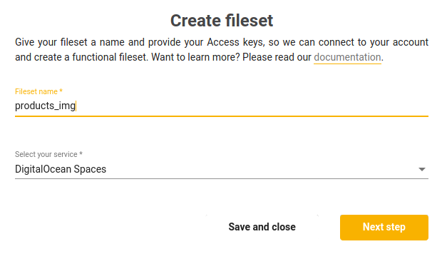

# Filesets

<iframe width="700" height="394" src="https://www.youtube.com/embed/S4Yz3I3MwGU" frameborder="0" allow="accelerometer; autoplay; encrypted-media; gyroscope; picture-in-picture" allowfullscreen></iframe>

JFS is used for indexing, fetching and manipulating files like any other data within your Jexia project. A fileset is a dataset but provides a way to maintain large data objects like files. At this point, we are working in cooperation with partners (Digital Ocean and AWS S3) so all of your files will be saved under your cloud storage. Jexia we will keep only metadata and the URL for the files, allowing you to manipulate the data in the same way as with dataset.

To work with files, you need to allow access to a specific fileset via a policy.
A fileset is very similar to a dataset with configuration and usage. This means there is a small learning curve to start using it at its full potential.

::: tip
A fileset is similar to other modules but can be used independently. It gives you the flexibility to choose what modules to use in your project. After future development, filesets will have more features related to files operations.
:::


When uploading or updating a file record, the following things should be kept in mind:
1. Each fileset contains a set of immutable fields: id, created_at, updated_at, size, type, url and status. These fields are generally used to contain the metadata of the file which is filled internally by our API. It is not possible to change validation, default values of these fields and their values.

2. If a request contains an immutable field, its value must be its current value. If this is not the case, it will fail with a bad request (400) error.

3. If a request contains an unknown field, it gets added automatically as a schemaless field for this record.

The fileset records contain the metadata of the file. Besides the custom fields there are some predefined ones:
1. **name** - Name of the file.
2. **size** - Size of the file in bytes.
3. **type** - File type (there are a few supported types, however, if the type is a mime-type, or if the type is not found, then the file's extension is stored).
4. **url** - Public URL to the file.
5. **status**:
    * **in_progress** - Jexia is still processing the file.
    * **succeeded** - File got uploaded and processed successfully.
    * **failed** - something went wrong during the upload or processing of the file.

Similarly to a dataset, you can get real-time notifications for a fileset. An example for this is shown below.

## Upload a File
Each request consists of two parts:

1. **data record** - It can be used to add some metadata to your file. As mentioned above if the data object contains a field, which is not in the schema, it will be added automatically as a schemaless field for this record.

2. **file record** - It contains the actual file.

<CodeSwitcher :languages="{js:'JavaScript',bash:'cURL'}">
<template v-slot:js>

``` js
import { jexiaClient, fileOperations, realTime } from "jexia-sdk-js/node";
import * as fs from "fs";

const jfs = fileOperations({
  uploadWaitForCompleted: true    
});

jexiaClient().init({
  projectID: "PROJECT_ID",
  key: "API_KEY",
  secret: "API_SECRET",
}, jfs, realTime());

const fileset = jfs.fileset("fileset_name");

const records = [{
  data: {
    description: "just a file"
  },
  file: fs.createReadStream("../assets/logo.png")
}];

fileset.upload(records).subscribe(fileRecord => {
  console.log(fileRecord);
});

```
</template>
<template v-slot:bash>

``` bash
curl 
-F 'description="this is my file"' 
-F 'file=@/path/to/file/my_file.txt' 
-X POST "https://<project-id>.app.jexia.com/fs/<fileset-name>"
```
::: warning
Only one file can be uploaded per request. In the future we hope to increase this. If there are multiple files in the body, only the first one will be processed and the rest will be ignored.
:::

</template>
</CodeSwitcher>

After execution, you will receive an array similar to the following array of objects:
``` json
[{ 
  "id": "11a12f17-8367-4114-a588-ae98a6cb3cda",
  "created_at": "2019-05-24T07:17:37.325882Z",
  "updated_at": "2019-05-24T07:18:40.455764Z",
  "name": "logo.png",
  "size": 42341,
  "type": "png",
  "url": "https://...",
  "status": "completed"
}]
```

Or, another response if the file is still being processed:

``` json
[{ 
  "id": "11a12f17-8367-4114-a588-ae98a6cb3cda",
  "created_at": "2019-05-24T07:17:37.325882Z",
  "updated_at": "2019-05-24T07:17:37.325882Z",
  "name": null,
  "size": null,
  "type": null,
  "url": null,
  "status": "in_progress"
}]
```

When you submit a file request the response will contain the ID along with the status. In most cases, the other metadata will be either empty or null.

This is because when you submit a request we process the file immediately and return a response. However, if the file is of a large size, then it might take some time to process it, if this is the case, the status will be `in_progress`.

When the process is finished and the file is uploaded we will send you an event via our real-time notifications to notify you of the status change. The final status can be a success or error depending on if the file was uploaded successfully.

::: tip
If you do not have real-time available for your project, you can do a request to the fileset and check the metadata.  
:::

## Fetch a File (metadata)
It's possible to query a fileset in the same way as datasets. The only difference is when performing an insert query, you need to use the `upload()` method instead.
All fileset records will have fields such as name, size, URL, etc. These fields, as well as any custom fields, can be used for select queries. Please keep in mind that these default fields are immutable.

<CodeSwitcher :languages="{js:'JavaScript',bash:'cURL'}">
<template v-slot:js>

``` js
jfs.fileset("fileset_name")  
 .select("name", "url")  
 .where(field => field("size").isGreaterThan(1024000))  
 .subscribe();  

// Array of files that fit to the condition will be returned  
// files === [{ name: "file1.jpj", url: "https://..." }, {...}, ...]  
```
</template>
<template v-slot:bash>

``` bash
$ curl -s 
-H "Authorization: Bearer $JEXIA_TOKEN" 
-X GET "https://$PROJECT_ID/ds/fileset_name?cond=\[\{\"field\":\"size\"\},\">\",1024000\]" | jq .
```

</template>
</CodeSwitcher>

## Update a File (metadata)
Updating a fileset works the same way as a dataset. 

::: warning
Updating a fileset record with a new file is not supported. Only the metadata can be changed. If you need to upload a new file, please create a new record. 
:::

<CodeSwitcher :languages="{js:'JavaScript',bash:'cURL'}">
<template v-slot:js>

``` js
jfs.fileset("fileset_name")  
 .update({ "isDefaultImage": false })  
 .where(field => field("name").isEqualTo("companyLogo.png"))
 .subscribe();  
```
</template>
<template v-slot:bash>

``` bash
$ curl -s 
-H "Authorization: Bearer $JEXIA_TOKEN" -d '{
  "id":"3005a8f8-b849-4525-b535-a0c765e1ef8e",
  "isDefaultImage":false
}'
-X PATCH "https://$PROJECT_ID/ds/fileset_name?cond=\[\{\"field\":\"size\"\},\">\",1024000\]" | jq .
```

</template>
</CodeSwitcher>


## Delete a File (metadata)

<CodeSwitcher :languages="{js:'JavaScript',bash:'cURL'}">
<template v-slot:js>

``` js
jfs.fileset("fileset_name")  
 .delete()  
 .where(field => field("size").isGreaterThan(1024000))  
 .subscribe();
```
</template>
<template v-slot:bash>

``` bash
$ curl -s 
-H "Authorization: Bearer $JEXIA_TOKEN" 
-X DELETE "https://$PROJECT_ID/ds/fileset_name?cond=\[\{\"field\":\"size\"\},\">\",1024000\]" | jq .
```

</template>
</CodeSwitcher>

::: warning
Please, keep in mind when deleting metadata that we are not deleting the file itself. It is done for decoupling, managing and storage for files. When you delete metadata Jexia excludes the file from all fetching results, but you can access the file itself via the direct link.
:::

## Setup Fileset for Digital Ocean
The process of setting up a Digital Ocean Space is very easy. As a first step, you need to create a **public space**. You can see the full tutorial for this on [Digital Ocean](https://www.digitalocean.com/community/tutorials/how-to-create-a-digitalocean-space-and-api-key). After this, you need to do 3 simple steps: 

1. As soon as you have your credentials for a space you can create a new Fileset
 

2. Next, you need to fill in all the necessary credentials: 
 

3. We will check the connection by loading a simple test file. If all operations are successful, you are ready to go:
 


## Setup Fileset for AWS S3
Currently, Jexia supports the ability to connect to an AWS S3 bucket. Below you can see the steps for connecting to an S3 bucket.

As soon as you log in to AWS console, go to the **S3 service**.


Here you need to click the **Create bucket** button and enter the name for your bucket.


In the next step, you can choose to configure options or leave the default values as they are.

Then on the **Set permissions** page, select all points related to ACL and deselect all others.


Ensure to check your settings, if they're correct, then create the bucket. As soon as this is done, open the bucket and go to **Permissions -> Bucket Policy**. Here you will be able to copy a JSON object configure access policies for your bucket. You can find a template for this on our [GitHub page](https://github.com/jexia/aws-info/blob/master/permissions.json)

::: warning
**Please change this row within the template by adding your bucket name, your Jexia integration will not work otherwise:** `"Resource": "arn:aws:s3:::bucket-name/*"`
:::

``` json
{
  "Version": "2012-10-17",
  "Statement": [
    {
      "Sid": "PublicAccess",
      "Effect": "Allow",
      "Principal": "*",
      "Action": "s3:GetObject",
      "Resource": "arn:aws:s3:::bucket-name/*"
    } 
  ]
}
```


We now need to create an access key for your bucket. Click on **My Account**, then select **My Security Credentials**.


Go to **Access keys** and create a new one.


A pop-up with credentials will appear. Make sure you save these credentials as you will need to use them later to finalise your configuration with Jexia.


Now, let's jump to the Jexia dashboard and create a new fileset.


In this step, you need to enter your **bucket name**, the **Access Key ID** and **Secret Access Key** that you received from AWS in the steps previous.


During creation, we will try to load an empty file to your bucket and then try to read it back. If all goes well, the new fileset will be created. In case of an error, the fileset will be created with an error sign. If this happens, you will need to double-check all steps described in this document.

That's all, happy coding!

