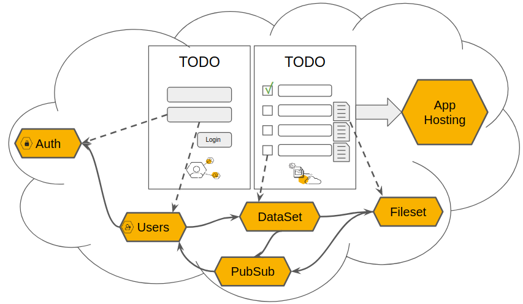
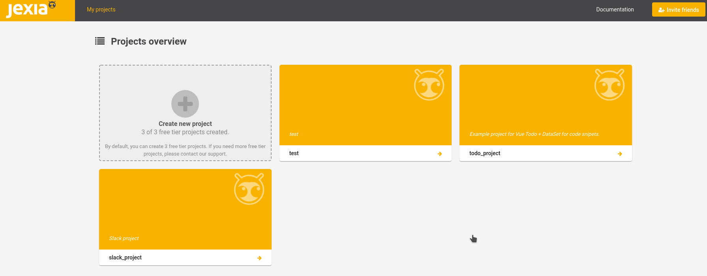
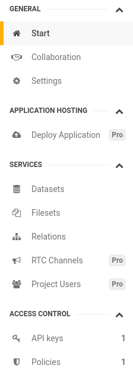
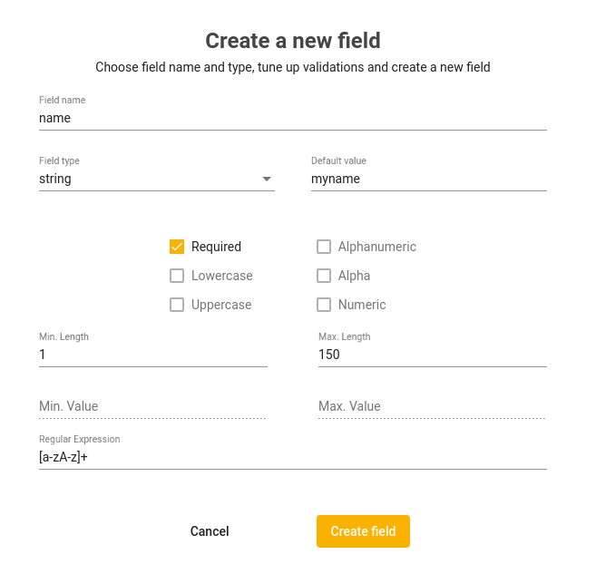
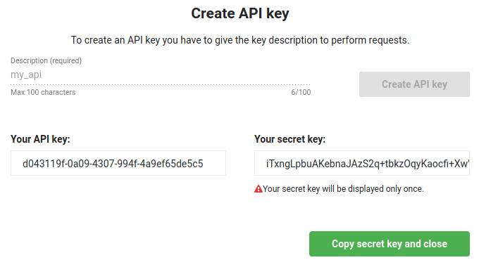
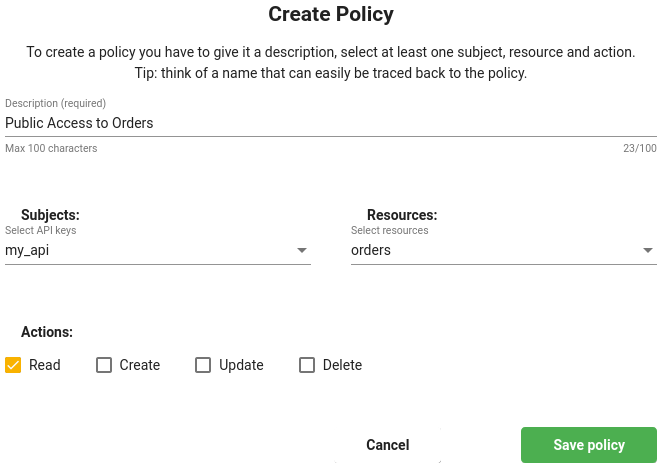
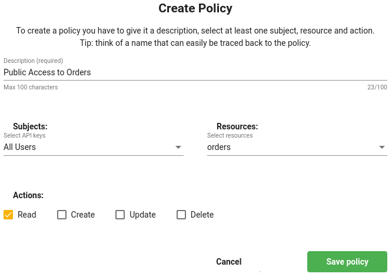
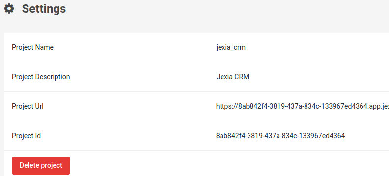

# Getting Started
**Jexia** is a Backend-as-a-Service (BaaS) solution featuring a comprehensive set of tools to cater for most of the routine tasks specific to the application development and operations processes. 



By using Jexia, you save time through the integration of existing, [basic services](#services) ([data](/dataset/) and [file](/fileset/) storage, [user management](/ums/), [authentication](/auth/), etc.) rather than developing them yourself. Moreover, you can [host your application](/apphost/) on the Jexia cloud thus eliminating the need to prepare, secure, scale, and monitor your environments.

## Create a project

The **Jexia** platform encompasses a set of natively integrated services which take out the routine tasks of application development and operations. You can use these services either together or independently of each other, giving you the flexibility to choose only those functionalities that you need while allowing easy integration with your projects via our REST API and SDKs.

You can [create](https://app.jexia.com/signup) your Jexia account by using an email or GitHub account.

After signing in, you will be greeted by the Jexia Dashboard. Here you can observe all your projects and switch between them. Inside the project, you can do all management operations as well as organize collaboration and integrations. This can also be done via our [CLI tool](https://jexia-cli.readthedocs.io/en/stable/).



You can create a project by clicking on the **Create Project** button.

<iframe width="700" height="395" src="https://www.youtube.com/embed/FY5QKc-gMj8" frameborder="0" allow="accelerometer; autoplay; encrypted-media; gyroscope; picture-in-picture" allowfullscreen></iframe>

You can have a maximum of **3** projects on the free plan, after you need to upgrade at least 1 project to a paid plan or delete a previous project on a free plan. The number of paid projects is unlimited, and they do not affect the number of projects you can have on a free plan.

## Inside the project

1. **Collaboration** - Within this section, you can coordinate access to your project. For example, you can invite a team member or a developer to be a collaborator on the same project. This will allow them access to the project from their Jexia account. 
1. **Settings** - Within this section, you can find the basic settings and information for the project (project name, description and URL). You may also delete the project within this section.
1. **Integration** - Within this section, you can set up a connection between your Jexia project and external services. This will allow you to use them within your automatons.

## Application Hosting
1. **Deploy Application** - This area allows you to **host applications in the cloud**. You can fetch an application directly from a git repository and deploy it on our cloud. Currently, you can host your Node JS application, your Docker images or simply static files.

## Services
1. [**Datasets**](/dataset/) - these are used to store your application data. For example products, orders, transactions, configurations and anything else.
1. [**Filesets**](/fileset/) - these are used to manage files for your application. For example avatars, blog images, product images, pdf documents and any other file you may need.
1. [**Relations**](/dataset/#related-data) - these provide an easy way to establish data relations between Datasets, Filesets and Project Users. It allows you to get related data within one request. But, no need to worry, all connections and optimizations are managed by Jexia.    
1. [**RTC Channels**](/pubsub/) - these are used to organize **Pub/Sub** solutions such as chats, online games and any other real-time application. We also provide a built-in real-time notification functionality for Datasets, Filesets and Project User modules.
1. [**Project Users**](/ums/) - these are the users within your application. Within this module, you can perform some specific functions, such as **changing passwords**, **creating users** and **deleting users** as well as supporting standard the CRUD approach over your API. You can choose any approach.
1. [**Automation**](/automation/) - this module allows you to set up actions that will run based on when different events occur.

## Access control
1. **API-Keys** - module for generating API keys. You can make keys that allow access to public data, private data or partners etc. By default, all data is private. Different access levels can be set via a **Policy**.
1. **Policy** - sets access rules for resources in your application. To create the policy you need to have at least one Project User or API key.

## Create Dataset
Let's create a Dataset which will allow us to store data accessible over our API.
<iframe width="700" height="350" src="https://www.youtube.com/embed/3Dt79oYyAsU" frameborder="0" allow="accelerometer; autoplay; encrypted-media; gyroscope; picture-in-picture" allowfullscreen></iframe>



Luckily, Jexia's Dataset module has schema and schemaless support, as well as field validation and default values for fields. This means you can spend less time testing and developing your database and more time developing your application. In the example below, we will create the Dataset "Orders".


Our Schema or Schemaless approach for Datasets allows the flexibility to start your development process without any particular model and then update your model on the fly.

::: warning
Please be aware there are some rules related to the schema and schemaless data:

1. When you create a schema field for a schemaless data entry, old data is not transferred to the newly created field.
2. When you insert an object which has fields out of schema, Jexia will automatically create a schemaless field and put data there.
3. When you delete a schema, field data will also be deleted. It will not be transferred to a schemaless field.  
:::

You do not need to be worried about database performance or index optimization etc., all this is handled by Jexia.

If you have some related data such as *Order / Product* or *Book / Author* you can establish a relational connection between them within the **Relation** section. You do not need to specify any fields as a foreign key for these relations as Jexia will handle all work related to relations. After this has been setup, Jexia will automatically organize data in its proper Dataset. When fetching data over your API, you can choose to include all relational items to the Dataset, or just fetch the data held on that item.   

## Creating the API & Polices
As a next step, we would need to establish access rules. By default, all data is inaccessible and we need to specify rules to allow access to certain resources.

There are two ways to organize this:
1. **API Key** - this is useful when you need to allow data access for many visitors. For example, show all blog posts, books or comments.
2. **Project User** - this is useful when you need to open access to a specific action, like **Update** or **Delete**. Setting this via project users ensures only specific people can perform certain actions.
3. **Namespace _(under development)_** - this allows you to group users together and provide common access to specific actions and records, such as creating an admin group and allowing these to delete records.

### Access via API Key
To have API key access, you firstly need to create an API key. For this, you need to visit the **API Keys** section and create a new key. **Please ensure you write the API secret somewhere as you will not be able to view it again.**



After go to the **Policies** section to specify which resources and actions should be made available for this API key. Once you have clicked **Create policy**, the **Subject** should be the newly created API key, in **Resources** select the required Datasets, Filesets or Channels. It is also important to select all allowed actions. These are: Create, Read, Update and Delete.



### Access via Project User
Go to the **Project Users** section and create a new user with an email and password. After this, go to the **Policies** area and click **Create policy**. As the **Subject** you should select **All Users**. When selecting the **Resources** needed, select the required Datasets, Filesets or Channels as well as actions. Once this has been done, all registered and activated users will have access to the resources selected.



## Interacting with data
Now let's make simple CRUD to access our Dataset. For this, you can use the REST API or one of our SDKs. Our [JS SDK](https://www.npmjs.com/package/jexia-sdk-js) is built on top of the RxJS library, so you can use all the power of this library. Other SDKs can be found on our [GitHub](https://github.com/jexia).

<iframe width="700" height="394" src="https://www.youtube.com/embed/i7v8FOS7_WI" frameborder="0" allow="accelerometer; autoplay; encrypted-media; gyroscope; picture-in-picture" allowfullscreen></iframe>

In this example, we are using the **JS SDK**. To install it, we need to run:
```
npm install jexia-sdk-js node-fetch ws --save
```

Below you can see an example with all the modules imported into the project. These are optional. If you do not need to access Filesets, Project Users (UMSModule) or real-time events, feel free to skip importing them.  

<CodeSwitcher :languages="{js:'JavaScript', bash:'cURL'}">
<template v-slot:js>

``` js
import { 
  // required main object
  jexiaClient,
  dataOperations, // To work with DataSets
  //fileOperations, // To work with FileSets 
  //UMSModule, // To work with Project Users
  //realTime // To get real-time notification for data changes and work channels  
} from "jexia-sdk-js/node";

const ds = dataOperations();
//const jfs = fileOperations();
//const ums = new UMSModule();
//const rtc = realTime();

// You need to use your API Key / API Secret which is generated within your Jexia application. 
// Do not forget make a Policy for your API!
jexiaClient().init({
  projectID: "PROJECT_ID",
  key: "API_KEY",
  secret: "API_SECRET",
}, ds); //jfs, ums, rtc

// Now you can run any CRUD operations for your Datasets
const orders = ds.dataset("orders");
const archive = ds.dataset("arch");
const selectQuery = orders
  .select()
  .where(field => field("dislike").isEqualTo(true));  

//const insertQuery = orders.insert([order1, order2]);  
//const updateQuery = orders.update([{ title: "Updated title" }]);  
//const deleteQuery = orders.delete();  

selectQuery.subscribe(records => {
    // You will always get an array of created records, including their 
    // generated IDs (even when inserting a single record) 
  },
  error => {
    // If something goes wrong, the error information is accessible here 
});
```
</template>
<template v-slot:bash>

``` bash
# Environment variables to be set
export PROJECT_ID=<project_id>
export API_KEY=<key_here>
export API_SECRET=<secret_here>
export TEST_USER=<user_here>
export TEST_USER_PSW=<password_here>

# save API key token to our environment in case we need to use it
export API_TOKEN=`curl -X POST -d '{
  "method":"apk",
  "key":"'"$API_KEY"'",
  "secret":"'"$API_SECRET"'"
}' "https://$PROJECT_ID.app.jexia.com/auth" | jq .access_token`

# save UMS token to our environment in case we need to access Project Users
export UMS_TOKEN=`curl -X POST -d '{
  "method":"ums",
  "email":"'"$TEST_USER"'",
  "password":"'"$TEST_USER_PSW"'"
}' "https://$PROJECT_ID.app.jexia.com/auth" | jq -r .access_token`

# Select all data with our API token
curl -H "Authorization: Bearer $API_TOKEN"
  -X GET "https://$PROJECT_ID.app.jexia.com/ds/orders" | jq .
# or with ums token
curl -H "Authorization: Bearer $UMS_TOKEN"
  -X GET "https://$PROJECT_ID.app.jexia.com/ds/orders" | jq .
```

</template>
</CodeSwitcher>

## Delete project

To delete your project you need to first remove the application from within the **Application Hosting** section. Then go to **Settings** and click **Delete**, you would need to provide your password to ensure it's you.

::: danger
Please, be aware. All data will be deleted and we will not be able to restore it. Please, use these function carefully.
:::



## Collaboration 
With collaboration, you can share work with members of your team. You can invite them to help with setting up, helping with a deployment and other administration work. This can speed up the development process and decrease the overall delivery time. Currently, you can only invite users with a Jexia account.   

## Examples & Open-source
There are many examples you can find on our [GitHub](https://github.com/jexia). You will also find parts of our platform which we decided to make open-source (including these docs!).

In the long run, we plan to open-source most of the Jexia platform. From another side, we understand that open-source projects come with big responsibilities to ensure they are well maintained and have a large time demand for supporting communities. As for now, we have decided to focus on adding new functionality to the platform, to provide more opportunities for our friends.  

Happy coding! 

