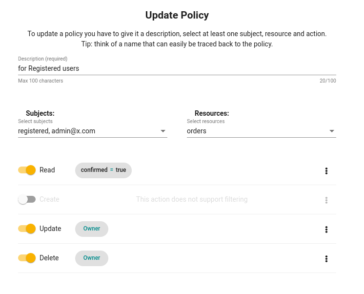

# Getting started
## Create project

**Jexia** is a platform with set of services natively integrated between each others which take out routine task for application development and operation. Good thing that you can use services together or independently. It gives you flexibility to choose functionality what you need and have easy integration with your project via REST API and SDK's.  

You can [create](https://app.jexia.com/signup) Jexia account by using email or GitHub account. 

First place after sign in, will be Jexia Dashboard. Here you can observe all your projects and switch between them. Inside project you can do all management operations as well as organise collaboration and integration. Same operation you can do via our 


You can creatate project by clicking on Create Project button.

You can have maximum **3** projects with free plan, after you need to upgrade at least 1 project to paid version or delete some project. 

## Inside the project

1. **Collaboratin** - under this menu you can coordinate access to your project setup. For example you are working with team mate who is busy with operation or development. You can invite him to be as collaborator for yuor project and together you can finish all much faster.  
1. **Settings** - under this menu you can find basic setup for project (project name, description, url) as well as you can delete project.
1. **Integration** - this section allow you to setupconnection between Jexia project and external services. You will be able to use them in your automation setup. 

## Services
1. **Application Hosting** - is used to **host application in the cloud**. You can use it for static file hosting as well as for NodeJS applications. 
1. **Dataset** - is used to store your application data. For example products, orders, transactions, configurations, other.
1. **Fileset** - is used to manage files for your application. For example: avatars, blog images, product images, pdf documents, others.
1. **Relations** - provide easy way to establish data relations between Dataset-Fileset-Project Users. It allows you to get related data within one request. All connection and optimisations are managed by Jexia you do not need to care about this.    
1. **RTC Channels** - is used to organise **Pub/Sub** solutions such as chats, online games others. As well this module is adding real-time notification functionality for Dataset, Fileset, Project Users modules. 
1. **Project Users** - is used to manage users for your application. Module has some specific functions, like **change password**, **sing up**, **sign in** as well as supporting standart CRUD approach. You can choose any apprach. 
1. **Automation** - this module allow you to setup actions which will run based on some event.

## Access control
1. **API-Keys** - module for API-Keys generations. You can make keys for public data, private data, partners, etc. By default all data is closed for public. Authorisation is managed via Policy. 
1. **Policy** - authorisation access to resources in your application. To create policy you need to have at least one Project User or API-Key. 

## Create DataSet


Let's create Dataset to have some cloud storage for our data.  
Good things Jexia Dataset has schema and schemaless support as well as field validation, default values for fields. So you do not need to spend time for developing and testing this. We will create Dataset Orders.


Good thing about Dataset that it can store data with Schema or Schemaless approach, it gives you flexibility to start your development without any particular model and update all on the fly. 

::: warning
Please, be aware there are some rules related to schema and schemaless data:

1. When you create schema field data from schemaless filed is not transfer to newly created field.
2. When you insert object which has fields out of schema, Jexia will automaticaly create schemaless field and put data there.
3. When you delete schema field data will be deleted as well versus transfer it into schemaless field.  
:::

You do not need to care about indexes optimisation etc. All this will be done by Jexia.

If you have some related data such Order - Product or Book - Author you can establish connection between them under Relation menu. You do not need to specify any fields as foreign key for this. Jexia will handle all work related to connections. After setup Jexia will automatically put data in proper Dataset. When you will fetch data you can get result with related data or without it.   

## Create API & Policy
As a next step we would need to establish authorisation rules. By default all data are closed and we need to specify rules to show resources. 

There are two ways to organize this:
1. API-KEY - will be usefull when you need to open data for many visitors. For example show all blog posts or books or comments.
2. Project User - will be useful when you need to open access to specific action, like Update or Delete. So only specific people can do this.
3. Namespace (under development now) - you can group users under some name and provide common access to specific actions and records. 

### Access via API-KEY
To have API-KEY access, first you need to create API-KEY. For this you need to go to Access Control - API-Keys and create new one. **Please write somewhere API-secret, you will not be able to get it again.** 


After go to **Access Control - Policies** to specify which resources and action available for this API-KEY. As a Subject you can selected newly created API-KEY, in Resources select needed Datasets(Filesets or Channels), select an allowed actions: Create, Read, Update, Delete.  


### Access via Project User
Go to **Services - Project Users** and create one user with email and password. 
After go to **Access Control - Policies**, in Subject select **AllUsers** in Resources needed Datasets (Filesets or Channels) as well as actions. With this all registered and activeted users will have Read access to orders dataset


## Interact with data
Now let's make simple CRUD to our dataset. For this you can use REST API or JS SDK.  is build on top of RxJS library, so you can use all power of this library.

To install JS SDK into our project we need to run:
::: tip
npm install jexia-sdk-js node-fetch ws --save
:::

Below you can see example with all modules imported into project. This is optional. If you do not need Fileset or Projec User(UMSModule), real-time feel free to skip importing them.  

<CodeSwitcher :languages="{js:'JavaScript',bash:'cURL'}">
<template v-slot:js>

``` js
// Jexia client
import { jexiaClient } from "jexia-sdk-js/node"; 
//DataSet operation
import { dataOperations } from "jexia-sdk-js/node";
// FileSet operations
import { fileOperations } from "jexia-sdk-js/node";
// Project Users
import { UMSModule } from "jexia-sdk-js/node";
// To have real-time notifications & channels 
import { realTime } from "jexia-sdk-js/node";
// jexia-sdk-js/browser - if you run Jexia from browser;

const ds = dataOperations();
const jfs = fileOperations();
const ums = new UMSModule(); 
const rtc = realTime(); 

jexiaClient().init({
  projectID: "project_id",
  key: "API_KEY",
  secret: "API_SECRET",
}, ds, jfs, ums, rtc);

const orders = dataModule.dataset("orders");
const archive = dataModule.dataset("arch");
const selectQuery = orders
      .select()
      .where(field => field("dislike").isEqualTo(true))
      .pipe(
        // put them into archive!
        switchMap(records => archive.insert(records)),
      );  
const insertQuery = orders.insert([order1, order2]);  
const updateQuery = orders.update([{ title: "Updated title" }]);  
const deleteQuery = orders.delete();  

// Either way, the response will be an array  
selectQuery.subscribe(records => { 
     // you will always get an array of created records, including their 
     //generated IDs (even when inserting a single record) 
  }, 
  error => { 
     // you can see the error info here, if something goes wrong 
});
```
</template>
<template v-slot:bash>

``` bash
# save API-Key token to env in case of API-Key usage
export PROJECT_ID=<project_id>
export API_KEY=<key_here>
export API_SECRET=<secret_here>
export TEST_USER=<>
export TEST_USER_PSW=<>
export UMS_TOKEN=`curl -X POST -d '{
  "method":"apk",
  "key":"'"$API_KEY"'",
  "secret":"'"$API_SECRET"'"
}' "https://$PROJECT_ID.app.jexia.com/auth"` | jq .access_token

# save UMS token to env in case you use Project Users
export UMS_TOKEN=`curl -X POST -d '{
  "method":"ums",
  "email":"'"$TEST_USER"'",
  "password":"'"$TEST_USER_PSW"'"
}' "https://$PROJECT_ID.app.jexia.com/auth"` | jq -r .access_token

# Select all data
curl -H "Authorization: Bearer $UMS_TOKEN" 
  -X GET "https://$PROJECT_ID.app.jexia.com/ds/orders" | jq .
```

</template>
</CodeSwitcher>

## Delete project

To delete you project you need to remove remove all applications on Application Hosting. Then go on Settings menu. 
You would need to provide your user password to make it happned. 

::: danger
Please, be aware. All data will be deleted and we will not be able to restore it. Please, use it carefully. 
:::


