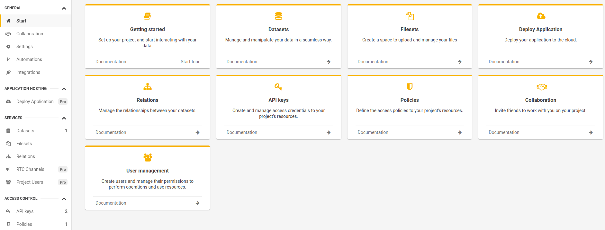

# Getting started
## Create project


**Jexia** is a platform with set of services natively integrated between each others which take out routine task for application development and operation. Good thing that you can use services together or independently. Which gives you flexibility in choosing functionality what you needs and have easy integration with your project.  

You can [create](https://app.jexia.com/signup) Jexia account by using email or your GitHub account. 

First place after you have created your account, will be Jexia Dashboard. From there you can do all management operations as well as organise collaboration and integration for your projects. 

You can creatate project by clicking on Create Project button.

You can have maximum **3** projects with free plan, after you need to upgrade at least 1 project to paid version. 
This option give you possibility to create new project with free plan. 

::: tip
Under Setting menu you can find project id as well as other options
:::

## Features


If you need more details, please, go to specific are in documentation.
1. **Dataset** - is used to store your application data. For example products, orders, transactions, configurations, other.
2. **Fileset** - is used to manage files for your application. For example: avatars, blog images, product images, pdf documents, other. 
3. **Project Users** - is used to manage your application users with specific functions, like **change password**, **sing up**, **sign in**.
4. **Policy** - is used to manage access to resource in your application. To create policy you need to have at least one Project User or API-Key. By default all data are closed from public.
5. **Application Hosting** - is used to **host application in the cloud**. It is possible to use application hosting as **FAAS** as well.
6. **RTC Channels** - is used to organise real-time **PubSub** solutions such as chats, online games others.

### There are some other supportive services:
1. **Relations** - provide easy way to establish data relations between Dataset-Fileset-Project Users. It allows you to get needed data in one request. 
2. **API-Keys** - place to generate API-Keys for your application. Usually you can use it to organise access to public data. Do not forget add policy for created API-Key, by default all data are closed from public.
3. **Collaboration** - provide opportunity to grant access to your project for another Jexia user. It is useful when you work under the project with your teams or partners. 
4. **Integrations** - provide possibilities to set up different integrations between Jexia and external word. for example SMTP server.
5. **Flows** - provide possibilites to run specific action for specific event. For example send email when Project User requested change password.  

## Create DataSet


Let's create Dataset to have some cloud storage for our application.  
Inside Dataset you can add fields, set up field validation, set up default values, so you do not need to develop or cover this by your own. We will create Dataset Orders with name, like, dislike fields.


Good thing about Dataset that it can store data in Schema or Schemaless approach, it gives you flexibility to start your development without any particular model and update all on the fly. 

::: warning
Please, be aware there are some rules related to schema and schemaless data:

1. When you create schema field data from schemaless filed is not transfer to newly created field.
2. When you insert object which has fields out of schema, Jexia will automaticaly create schemaless field and put data there.
3. When you delete schema field data will be deleted as well versus transfer it into schemaless field.  
:::

You do not need to care about indexes optimisation etc. All this will be done by Jexia.

If you have some related data such Order - Product or Book - Author you can establish connection between them under Relation menu. You do not need to specify any fields as foreign key for this. Jexia will handle all work related to connections. After setup Jexia will automatically put data in proper Dataset. When you will fetch data you can get result with related data or without it.   


## Create API & Policy
Next step will be to setup rules about what we want to show to the world. By default all data are closed and we need to specify what will be visible. 

There are two ways to organize this:
1. API-KEY - will be usefull to open data for many visitors. For example show all blog posts or books or comments.
2. Project User - will be useful when you need to open access to specific action, like Update or Delete. So only specific people can do this.
3. Namespace (under development now) - you can group users under some name and provide common access to specific actions and records. 

### Access via API-KEY
To have API-KEY access first you need to create API-KEY. For this you need to go to Access Control - API-Keys and create new one. **Please write somewhere API-secret, you will not be able to get it again.** 

After go to **Access Control - Policies** to specify which resources and action available for this API-KEY. As a Subject you can selected newly created API-KEY, in Resources select needed Datasets(Filesets or Channels), select an allowed actions: Create, Read, Update, Delete.  

### Access via Project User
Go to **Services - Project Users** and create one user with email and password. 
After go to **Access Control - Policies**, in Subject select **AllUsers** in Resources needed Datasets (Filesets or Channels) as well as actions. 

## Interact with data
Now let's make simple CRUD to our dataset. JS SDK build on top of RxJS library, so you can use all power of this library.
For this we need import JS SDK into our project first
::: tip
npm install jexia-sdk-js node-fetch ws --save
:::
<CodeSwitcher :languages="{js:'JavaScript',bash:'cURL'}">
<template v-slot:js>

``` js
// Jexia client
import { jexiaClient } from "jexia-sdk-js/node"; 
//DataSet operation
import { dataOperations } from "jexia-sdk-js/node";
// FileSet operations
import { fileOperations } from "jexia-sdk-js/node";
// Project Users
import { UMSModule } from "jexia-sdk-js/node";
// To have real-time notifications & channels 
import { realTime } from "jexia-sdk-js/node";
// to use .where and .outputs
import { field } from "jexia-sdk-js/node"; 
// jexia-sdk-js/browser;

const ds = dataOperations();
const jfs = fileOperations();
const ums = new UMSModule(); 
const rtc = realTime(); 

jexiaClient().init({
  projectID: "project_id",
  key: "API_KEY",
  secret: "API_SECRET",
}, ds, jfs, ums, rtc);

const orders = dataModule.dataset("orders");
const archive = dataModule.dataset("arch");
const selectQuery = orders
      .select()
      .where(field => field("dislike").isEqualTo(true))
      .pipe(
        // put them into archive!
        switchMap(records => archive.insert(records)),
      );  
const insertQuery = orders.insert([order1, order2]);  
const updateQuery = orders.update([{ title: "Updated title" }]);  
const deleteQuery = orders.delete();  

// Either way, the response will be an array  
insertQuery.subscribe(records => { 
     // you will always get an array of created records, including their 
     //generated IDs (even when inserting a single record) 
  }, 
  error => { 
     // you can see the error info here, if something goes wrong 
});
```
</template>
<template v-slot:ts>

``` bash
```

</template>
</CodeSwitcher>

## Delete project

To delete you project you need to remove remove all applications on Application Hosting. Then go on Settings menu. 
You would need to provide your user password to make it happned. 
::: danger
Please, be aware. All data will be deleted and we will not be able to restore it. Please, use it carefully. 
:::