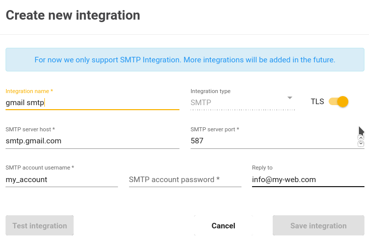

# Integration
The main purpouse of this module is to provide possibility to setup integration between Jexia and other platforms. 
For example I want to send some email via my SMTP server or make a HTTP call or send push notification. To archieve this I need to setup a bridge to another service. With Integration we can have all of such setup in one place. 

1. Integration name - descriptive name, will be visible in list of integrations.
2. Integration type - type of integration like SMTP, HTTP, etc. As for now we support only SMTP.
3. TLS - checkbox to specify if we need TLS handchake for SMTP gateway. If not SSL will be used.
4. SMTP server - SMTP server address.
5. SMTP PORT - SMTP server port. In most cases 587 is for TLS connection, 486 - for SSL. But you can apply your own option.
6. SMTP username - user name to connect to SMTP server.
7. SMTP password - password to connect to SMTP server. We are hashing password and will not be able to revert it. That is why you need to enter this again during editing process. 
8. Replay To - email which your client will see while getting email in replay to option.

As you can see there is buton `Test integration`, it allows you to test your credentials and will send some test email to your Jexia account email, so you can be sure that all setup are good and integration is working.

