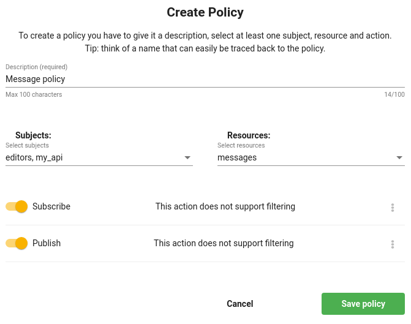

# PubSub
Nowadays many applications use real-time communication. To make it happen, you need to put servers somewhere to organize WebSocket communication. 

We, at Jexia, decided to eliminate this headache from you. Now you can use our Pub/Sub service and enjoy real-time communication between clients. Furthermore, in 1-click you can activate log storage for your channels and retrieve log when you need it. 

This service is commonly used for any kind of chat and messenger. As well it can be used to synchronize work for IOT devices, robots, drones, cars. 

This service is less integrated with others like Dataset but still, it uses real-time modules for communication and the same syntax for log management in persistent storage. You can grant access via Policy as for other services but you will not be able to set up relations with other services. 

## Configuration
To start working with channels first of all you need to create a channel. You can do it under the Channel menu. 


If you choose to keep message history all events from this channel will be stored in persistent storage so you can find them later. 
You can imagine persistence storage the same as Dataset so all query possibilities are applicable there.  

The next step would be Policy setup.


As you might see there is different action for channels versus other services. 
* Publish means you can send any data into a specific channel
* Subscribe  means you can read from a specific channel

You can use both or one of them to organize your project. 

## Usage
Below you can find an overview of how to use channels with JS SDK. 

``` js
import { jexiaClient, realTime } from "jexia-sdk-js";  
  
const rtm = realTime();  
 // Inititate Jexia Client 
jexiaClient().init({  
  projectID: "your-project-id",  
  key: "your-api-key",    
  secret: "your-api-secret"  
}, rtm);  

//Initiate a channel
const channel = rtm.channel("my_channel");

// Subscribe to listen messages
channel.subscribe(
  message => {
    console.log(message); // we've got a message from the channel
  },
  error => {
    console.log(error); // Subscription Error: (1001): resource "my_camel" is unavailable
  },
  () => { // complete
    // connection to the channel has been closed
  }
); 
// Send message to channel 
channel.publish({
  product: "apple",
  amount: 42
});  
// or
channel.publish("Some text string here...");  

// Get channel Log
channel
.getLog(field => field("sender_id").isEqualTo(user.id))  // Same filters as in DataSet
.subscribe(
  messages => {
    console.log(messages); 
  },
  error => {
    console.log(error); // Subscription Error: (2): none of the given actions ["read"] for this resource are allowed
  }
```

## Limitation
There is only one limitation you have, maximum message size cannot be more than 64 kb.
This is at least two times bigger than the offer from other companies. 
Enjoy your codding! 