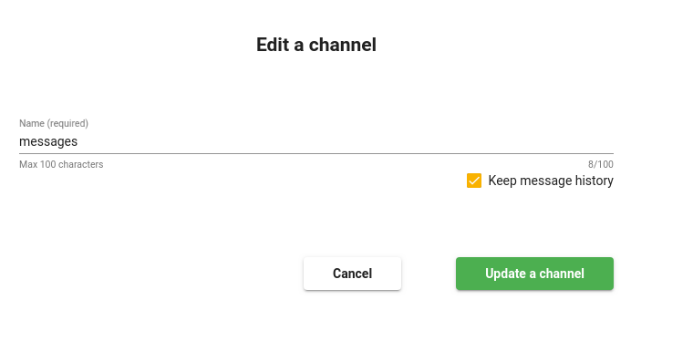
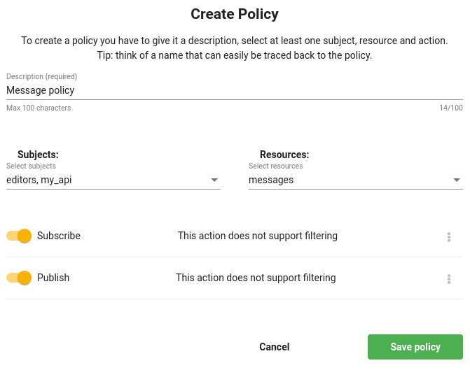

# <pro/> PubSub
Nowadays many applications use real-time communication. To make this happen, you need to create a server that can handle and interpret WebSocket communications. 

With Jexia this is already setup. You can use our Pub/Sub service and enjoy real-time communication between clients. Furthermore, in 1-click you can activate log storage for your channels and retrieve logs when you need it.

This service is commonly used for any kind of chat and messenger. It can also be used to synchronize work for IoT devices, robots, drones and cars etc. 

This service is less integrated with other modules such as Dataset. But they still use real-time modules for communication and the same syntax for log management in persistent storage. You can grant access via **Policy** like you would other services, but you will not be able to set up relations. 

## Configuration
To start working with channels you need to create a channel. You can do it under the **Channel** section.

If you choose to keep message history, all events from this channel will be stored in persistent storage so you can find them later. 
You can think of persistent storage the same as a dataset, this means all query possibilities for datasets are also applicable here.  

The next step is setting up a Policy.

As you might see there is different action for channels compared to other services. 
* **Publish** - you can send any data into a specific channel.
* **Subscribe** - you can read from a specific channel.

You can use both or one of them to organize your project. 

## API usage
- [JavaScript SDK](./SDK.md)
- [WebSocket protocol description](./Protocol.md) (for when SDK is not used)

## Limitation
There is only one limitation, the maximum message size cannot be more than 64 kb.

Enjoy coding! 
